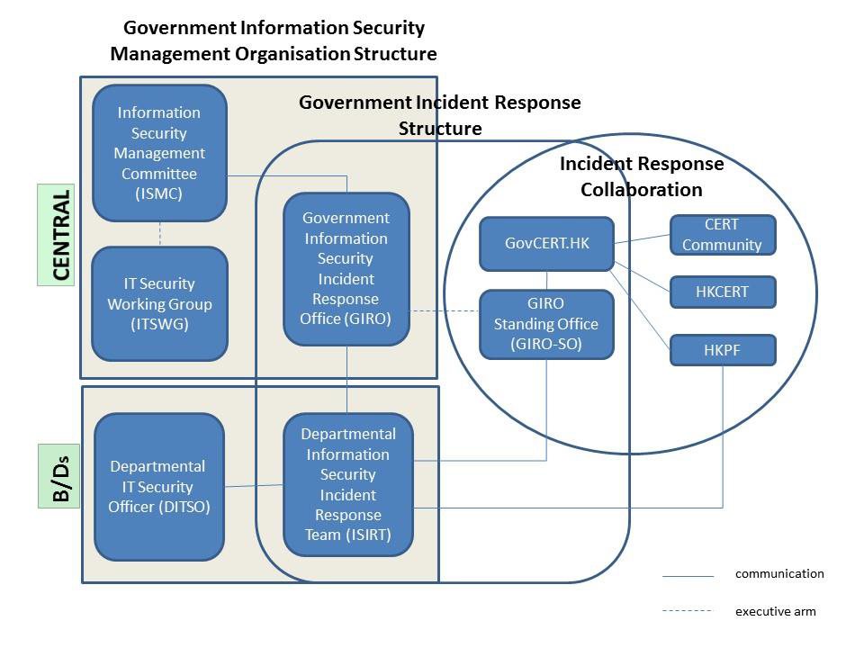

= IT Security Guidelines 
:title: IT Security Guidelines [G3]
:edition: 8.0
:docnumber: G3
:copyright-year: 2016
:doctype: 
:language: en
:status: published
:keywords: 
:submitting-organizations: 
:docfile: G3.adoc
:mn-document-class: ogc
:mn-output-extensions: xml,html,doc,pdf,rxl
:local-cache-only:
:data-uri-image:

NOTE: The contents of this document remain the property of and may not be reproduced in whole or in part without the express permission of the Office of the Government Chief Information Officer

== COPYRIGHT NOTICE

© 2016 by the Government of the Hong Kong Special Administrative Region
Unless otherwise indicated, the copyright in the works contained in this publication is owned by the Government of the Hong Kong Special Administrative Region. You may generally copy and distribute these materials in any format or medium provided the following conditions are met –

. the particular item has not been specifically indicated to be excluded and is therefore not to be copied or distributed;

. the copying is not done for the purpose of creating copies for sale;

. the materials must be reproduced accurately and must not be used in a misleading context; and

. the copies shall be accompanied by the words “copied/distributed with the permission of the Government of the Hong Kong Special Administrative Region. All rights reserved.”

If you wish to make copies for purposes other than that permitted above, you should seek permission by contacting the Office of the Government Chief Information Officer.

[%unnumbered]
|=== 
5+^.^h| Amendment History
^.^| Change Number ^.^| Revision Description ^.^| Pages Affected ^.^| Revision Number ^.^| Date
^.^| 1 | The Revision Report is available at the government intranet portal ITG InfoStation | ^.^| 4.0 ^.^| April 2003
^.^| 2 | Change “Information Technology Services Department” (or “ITSD” ) to “Office of the Government Chief Information Officer” (or “OGCIO”) | ^.^| 4.1 ^.^| July 2004
^.^| 3 | Enrich/enhance the document to include more detailed guidance in: +
- section 10.1.1 “Security Considerations in Application Design and Development” and section 10.7. “WEB APPLICATION SECURITY” for application security +
- section 10.4. “PROGRAM/SYSTEM TESTING” and section 11.3. “EMAIL SECURITY” for proper/restrictive disclosure of information +
- section 11.2. “INTERNET SECURITY” for proper restriction of network traffic/ports and system services +
Change “HKCERT/CC” to “HKCERT” as the revised acronym for Hong Kong Computer Emergency Response Team Coordination Centre ^.^| 10-2, + 
10-3 +
10-7 +
10-5 +
11-4 +
11-3 +
2-3, +
11-15, +
13-1 ^.^| 4.2 ^.^| September 2004
^.^| 4 | Updates were made accordingly to comply with the revised Security Regulations Chapter IX ^.^| 9-3, +
9-11, +
11-2 ^.^| 4.3 ^.^| November 2004
^.^| 5 | The Revision Report is available at the government intranet portal ITG InfoStation | ^.^| 5.0 ^.^| May 2006
^.^| 6 | Updated Appendix B accordingly based on the revised Security Regulations. Appendix C was updated and all six data protection principles were included. ^.^| B-2 +
C-1 ^.^| 5.1 ^.^| November 2008
^.^| 7 | The Revision Report is available at the government intranet portal ITG InfoStation | ^.^| 6.0 ^.^| December 2009
^.^| 8 | The Revision Report is available at the government intranet portal ITG InfoStation | ^.^| 7.0 ^.^| September 2012
^.^| 9 | The Revision Report is available at the government intranet portal ITG InfoStation: (http://itginfo.ccgo.hksarg/content/itsecure/ review2016/amendments.shtml) | ^.^| 8.0 ^.^| December 2016
|===

== PURPOSE

This document elaborates policy requirements and sets implementation standard on the security requirements specified in the Baseline IT Security Policy, and provides implementation guidance for effective implementation of corresponding security measures.

The materials included in this document are prepared irrespective of computer platforms. B/Ds shall follow the guidance in this document to implement security controls to satisfy the relevant security requirements. B/Ds may need to customise the security measures appropriate to their circumstances without prejudice to the security level.

== SCOPE

=== Applicability

This guideline adopts and adapts the security areas and controls specified in the
International Organization for Standardization (ISO) and the International
Electrotechnical Commission (IEC) standards on information security management
systems (ISO/IEC 27001:2013) and code of practice for information security
controls (ISO/IEC 27002:2013). This document describes security considerations in
the following 14 areas:

* Management responsibilities (see <<management_responsibilities>>);

* IT security policies (see <<it_security_policies>>);

* Human resource security (see <<human_resource_security>>);

* Asset management (see <<asset_management>>);

* Access control (see <<access_control>>);

* Cryptography (see <<cryptography>>);

* Physical and environmental security (see <<physical_and_environmental_security>>);

* Operations security (see <<operations_security>>);

* Communications security (see <<communications_security>>);

* System acquisition, development and maintenance (see <<system_acquisition>>);

* Outsourcing security (see <<outsourcing_security>>);

* Security incident management (see <<security_incident_management>>);

* IT security aspects of business continuity management (see <<it_security_aspects>>); and

* Compliance (see <<compliance>>)

Basically, these considerations should be taken into account in all phases of the
System Development Life Cycle (SDLC). There are, however, specific areas in
certain SDLC phases which need special attention. These areas are highlighted in
the chart in the following page.

[[fig1]]
.Security Considerations Related to Different Phases of System Development Life Cycle
image::images/001.png[width=auto,height=auto]

=== Target Audience

The document is developed for all levels of staff acting in different roles within B/Ds, including management staff, IT administrators, and general IT end users. It is the responsibility for ALL staff to read through the document to understand and follow in order to implement the security requirements effectively.

In addition, the document is intended for use by vendors, contractors and consultants who provide IT services to the Government.

=== Government IT Security Documents

The Government has promulgated a set of security regulations and government IT security policy and guidelines to assist B/Ds in formulating and implementing their
IT security policies and control measures to safeguard government’s information
security. B/Ds shall comply with the policy requirements in both the Security Regulations (SR) and the Baseline IT Security Policy (S17), and also follow the implementation guidance in the IT Security Guidelines (G3).

The following diagram describes the relationship of various IT security documents within the Government:

[[fig2]]
[%unnumbered]
image::images/002.png[width=auto,height=auto]

[[security_regulations]]
==== Security Regulations

Security Regulations, authorised by Security Bureau, provide directives on what documents, material and information may need to be classified and to ensure that they are given an adequate level of protection in relation to the conduct of government business. Chapter IX provides specific requirements to regulate the security of government records in electronic form.

[[government_it_security_policy]]
==== Government IT Security Policy and Guidelines

Government IT Security Policy and Guidelines, established by the Office of the Government Chief Information Officer, aim at providing a reference to facilitate the implementation of information security measures to safeguard information assets. References have been made to recognised International standards on information security management systems (ISO/IEC 27001:2013) and code of practice for information security controls (ISO/IEC 27002:2013).

They set out the minimum standards of security requirements and provide guidance on implementing appropriate security measures to protect information assets and information systems.

*Baseline IT Security Policy (S17)*:: A top-level directive statement that sets the minimum standards of a security specification for all B/Ds. It states what aspects are of paramount importance to a B/D. Thus, the Baseline IT Security Policy can be treated as basic rules which shall be observed as mandatory while there can still be other desirable measures to enhance the security.

*IT Security Guidelines (G3)*:: Elaborates on the policy requirements and sets the implementation standard on the security requirements specified in the Baseline IT Security Policy. B/Ds shall follow the IT Security Guidelines for effective implementation of the security requirements.

In addition, there are a number of practice guides that are supplementary documents to the IT Security Guidelines. They provide guidance notes on specific security areas to help B/Ds address and mitigate risks brought by emerging technologies and security threats. Examples of these practice guides include Practice Guide for Internet Gateway Security, Practice Guide for Security Risk Assessment & Audit and Practice Guide for Information Security Incident Handling, etc.

All practice guides are available at the ITG InfoStation under the IT Security Theme Page (https://itginfo.ccgo.hksarg/content/itsecure/techcorner/practices.shtml).

==== Departmental IT Security Policies, Procedures and Guidelines

B/Ds shall formulate their own departmental IT policies, procedures and guidelines based on all the government security requirements and implementation guidance specified in the Security Regulations and the Government IT Security Policy and Guidelines mentioned in <<security_regulations>> and <<government_it_security_policy>> above.

== NORMATIVE REFERENCES

. The Government of the Hong Kong Special Administrative Region, “Security Regulations”

. Baseline IT Security Policy [S17]

. Information technology – Security techniques – Information security management systems – Requirements, ISO/IEC 27001:2013, dated 1 October 2013

. Information technology – Security techniques – Code of practice for information security management, ISO/IEC 27002:2013, dated 1 October 2013

. The HKSARG Interoperability Framework [S18]

== Definitions and conventions

=== Definitions

Information System:: A related set of hardware and software organised for the collection, processing, storage, communication, or disposition of information.

Confidentiality:: Only authorised persons are allowed to know or gain access to the information stored or processed by information systems in any aspects.

Integrity:: Only authorised persons are allowed to make changes to the information stored or processed by Information Systems in any aspects.

Availability:: Information System is accessible and usable upon demand by authorised persons.

IT Security Policy:: A documented list of management instructions that describes in detail the proper use and management of computer and network resources with the objective to protect these resources as well as the information stored or processed by Information Systems from any unauthorised disclosure, modifications or destruction.

Classified Information:: Refers to the categories of information classified in accordance with the Security Regulations.

Staff:: A collective term used to describe all personnel employed or whose service is acquired to work for the Government, including all public officers irrespective of the employment period and terms, non-government secondees engaged through employment agencies, and other term contract services personnel, etc., who may have different accessibility to classified information and are subject to different security vetting requirements. Specific requirements governing human resource security are found in Section 9 of S17.

Data Centre:: A centralised data processing facility that houses Information Systems and related equipment. A control section is usually provided that accepts work from and releases output to users.

Computer Room:: A dedicated room for housing computer equipment.

Malware:: Programs intended to perform an unauthorised process that will have adverse impact on the confidentiality, integrity, or availability of an Information System. Examples of malware include computer viruses, worms, Trojan horses, and spyware etc.

Mobile Devices:: Portable computing and communication devices with information storage and processing capability. Examples include portable computers, mobile phones, tablets, digital cameras, audio or video recording devices.

Removable Media:: Portable electronic storage media such as magnetic, optical, and flash memory devices, which can be inserted into and removed from a computing device. Examples include external hard disks or solid-state drives, floppy disks, zip drives, optical disks, tapes, memory cards, flash drives, and similar USB storage devices.

=== Conventions

The following is a list of conventions used in this document

Shall:: The use of the word ‘shall’ indicates a mandatory requirement. 

Should:: The use of the word ‘should’ indicates a best practice, which should be implemented whenever possible. 

May:: The use of the word ‘may’ indicates a desirable best practice.

== GOVERNMENT ORGANISATION STRUCTURE ON INFORMATION SECURITY

=== Government Information Security Management Framework

To coordinate and promote IT security in the Government, an Information Security
Management Framework comprising the following four parties has been established:

* Information Security Management Committee (ISMC).

* IT Security Working Group (ITSWG).

* Government Information Security Incident Response Office (GIRO).

* Bureaux/Departments.

[[fog3]]
.Government Information Security Management Framework

The roles and responsibilities of each party are explained in details in the following sections.

==== Information Security Management Committee (ISMC)

A central organisation, the Information Security Management Committee (ISMC), was established in April 2000 to oversee IT security within the whole government. The committee meets on a regular basis to:

* Review and endorse changes to the Government IT security regulations, policies
and guidelines. 

* Define specific roles and responsibilities relating to IT security. 

* Provide guidance and assistance to B/Ds in the enforcement of IT security
regulations, policies, and guidelines through the IT Security Working Group (ITSWG).

The core members of ISMC comprise representatives from:

* Office of the Government Chief Information Officer (OGCIO).

* Security Bureau (SB).

Representative(s) from other B/Ds will be co-opted into the committee on a need basis, in relation to specific subject matters.

==== IT Security Working Group (ITSWG)

The IT Security Working Group (ITSWG) serves as the executive arm of the ISMC in the promulgation and compliance monitoring of government IT security regulations, policies and guidelines. The ITSWG was established in May 2000 and its responsibilities are to:

* Co-ordinate activities aimed at providing guidance and assistance to B/Ds in the enforcement of IT security regulations, policies and guidelines. 

* Monitor the compliance with the Baseline IT Security Policy at B/Ds. 

* Define and review the IT security regulations, policies and guidelines. 

* Promote IT security awareness within the Government.

The core members of ITSWG comprise representatives from:

* Office of the Government Chief Information Officer (OGCIO).

* Security Bureau (SB).

* Hong Kong Police Force (HKPF).

* Chief Secretary for Administration’s Office (CSO).

Representative(s) from other B/Ds will be co-opted into the working group on a need basis, in relation to specific subject matters.

==== Government Information Security Incident Response Office (GIRO)

To handle information security incidents occurring in B/Ds, an Information Security Incident Response Team (ISIRT) shall be established in each B/D. The Government Information Security Incident Response Office (GIRO) provides central coordination and support to the operation of individual ISIRTs of B/Ds. The GIRO Standing Office serves as the executive arm of GIRO.

The Government Computer Emergency Response Team Hong Kong (GovCERT.HK) was established in April 2015. In addition to collaborating with GIRO Standing Office in coordinating information and cyber security incidents within the Government, it also collaborates with the computer emergency response team community in sharing incident information and threat intelligence, and exchanging best practices with a view to strengthening information and cyber security capabilities in the region. GovCERT.HK has the following major functions:

* Disseminate security alerts on impending and actual threats to B/Ds.

* Act as a bridge between the Hong Kong Computer Emergency Response Team Coordination Centre (HKCERT) and other computer security incident response teams (CSIRT) in handling cyber security incidents.

The GIRO has the following major functions:

* Maintain a central inventory and oversee the handling of all information security
incidents in the Government. 

* Prepare periodic statistics reports on government information security incidents. 

* Act as a central office to coordinate the handling of multiple-point security attacks (i.e. simultaneous attacks on different government information systems). 

* Enable experience sharing and information exchange related to information security incident handling among ISIRTs of different B/Ds.

The core members of GIRO comprise representatives from:

* Office of the Government Chief Information Officer (OGCIO).

* Security Bureau (SB).

* Hong Kong Police Force (HKPF).

==== Bureaux/Departments

B/Ds shall be responsible for the security protection of their information assets and information systems. The roles and responsibilities of IT security staff within a B/D are detailed in <<departmental_it_security_organisation>> -DEPARTMENTAL IT SECURITY ORGANISATION.

[[departmental_it_security_organisation]]
=== Departmental IT Security Organisation

This section explains the individual role and responsibility of a departmental IT Security organisation. In order to have sufficient segregation of duties, multiple roles should not be assigned to an individual unless there is a resource limitation.

The following diagram describes a sample Departmental IT Security organisational framework:

[[fig4]]
.An Example Organisation Chart for Departmental IT Security Management {blank}footnote:[The actual IT Security Management structure may vary according to the circumstances of each organisation.]
image::images/004.png[width=auto,height=auto]

==== Senior Management

The senior management of B/Ds shall have an appreciation of IT security, its problems and resolutions. His / her responsibilities include:

* Direct and enforce the development of security measures.

* Provide the necessary resources required for the measures to be implemented.

* Ensure participation at all levels of management, administrative, technical and operational staff, and provide full support to them.

Senior management should consider the setting up of an information security steering committee, or including information security as one of the regular discussion items in management meetings. This will provide an ongoing basis to ensure the alignment of security strategy with business objectives.

==== Departmental IT Security Officer (DITSO)

Head of B/D shall appoint an officer from the senior management to be the Departmental IT Security Officer (DITSO) and responsible for IT security. Directorate officer responsible for IT management of the B/D is considered appropriate to take up the DITSO role. Depending on the size of the department, departmental grade officers at directorate grade who understand the B/D’s priorities, the importance of the B/D’s information systems and data assets, and the level of security that shall be achieved to safeguard B/Ds, are also considered suitable.

If a B/D is ultimately unable to appoint a directorate officer as DITSO, the Head of B/D should appoint a senior staff delegated with sufficient authorities in mobilising resources and making decisions in handling high threat event or security incident, and such delegation should be made known to all concerned staff of the B/D.

To better equip the designated DITSOs with security management and related technology knowledge or skills, SB and OGCIO will provide training to DITSOs to facilitate them in carrying out their duties. B/Ds should ensure that the designated DITSOs have duly received such training. The roles and responsibilities of DITSO shall be clearly defined which include but are not limited to the following:

* Establish and maintain an information protection program to assist all staff in the protection of the information and information system they use.

* Establish proper security governance process to evaluate, direct, monitor and communicate the IT security related activities within the B/D.

* Lead in the establishment, maintenance and implementation of IT security policies, standards, guidelines and procedures.

* Monitor, review and improve the effectiveness and efficiency of IT security management.

* Coordinate with other B/Ds on IT security issues.

* Disseminate security alerts on impending and actual threats from the GIRO to responsible parties within the B/D.

* Ensure information security risk assessments and audits are performed as necessary.

* Initiate investigations and rectification in case of breach of security.

DITSO may line up an IT security working team within the B/D to assist in leading, monitoring and coordinating of IT security matters within the B/D.

==== Departmental Security Officer (DSO)

According to the Security Regulations, the Head of B/D will designate a Departmental Security Officer (DSO) to perform the departmental security related duties. The DSO will take the role as an executive to:

* Discharge responsibilities for all aspects of security for the B/D. 

* Advise on the set up and review of the security policy.

The DSO may take on the role of the DITSO. Alternatively, in those B/Ds where someone else is appointed, the DITSO shall collaborate with the DSO to oversee the IT security of the B/D.

==== Departmental Information Security Incident Response Team (ISIRT) Commander

The ISIRT is the central focal point for coordinating the handling of information security incidents occurring within the respective B/D. Head of B/D should designate an officer from the senior management to be the ISIRT Commander. The ISIRT Commander should have the authority to appoint core team members for the ISIRT. The responsibilities of an ISIRT Commander include:

* Provide overall supervision and co-ordination of information security incident handling for all information systems within the B/D.

* Make decisions on critical matters such as damage containment, system recovery, the engagement of external parties and the extent of involvement, and service resumption logistics after recovery etc.

* Trigger the departmental disaster recovery procedure where appropriate, depending on the impact of the incident on the business operation of the B/D.

* Provide management endorsement on the provision of resources for the incident handling process.

* Provide management endorsement in respect of the line-to-take for publicity on the incident.

* Collaborate with GIRO in the reporting of information security incidents for central recording and necessary follow up actions.

* Facilitate experience and information sharing within the B/D on information security incident handling and related matters.

=== Other Roles

==== IT Security Administrators

IT Security Administrators shall be responsible for providing security and risk management related support services. His / her responsibilities also include:

* Assist in identifying system vulnerabilities.

* Perform security administrative work of the system.

* Maintain control and access rule to the data and system.

* Check and manage audit logs.

* Promote security awareness within the B/D.

The IT Security Administrator may be a technical person, but he/she should not be the same person as the System Administrator. There should be segregation of duties between the IT Security Administrator and the System Administrator.

Although IT Security Administrator is responsible for managing the audit logs, they should not tamper or change any audit log.

B/Ds may appoint an IT Security Auditor, who will be responsible for auditing the work of the IT Security Administrators to assure that they perform their duties due diligently.

==== Information Owners

Information Owners shall be the collators and the owners of information stored in information systems. Their primary responsibility is to:

* Determine the data classifications, the authorised data usage, and the corresponding security requirements for protection of the information.

==== LAN/System Administrators

LAN/System Administrators shall be responsible for the day-to-day administration, operation and configuration of the computer systems and network in B/Ds, whereas Internet System Administrators are responsible for the related tasks for their Internet-facing information systems. Their responsibilities include:

* Implement the security mechanisms in accordance with procedures/guidelines established by the DITSO.

==== Application Development & Maintenance Team

The Application Development & Maintenance Team shall be responsible for producing the quality systems with the use of quality procedures, techniques and tools. Their responsibilities include:

* Liaise with the Information Owner in order to agree on system security requirements.

* Define the solutions to implement these security requirements.

==== Users

Users of information systems shall be the staff authorised to access and use the information. Users shall be accountable for all their activities. Responsibilities of a user include:

* Know, understand, follow and apply all the possible and available security mechanisms to the maximum extent possible.

* Prevent leakage and unauthorised access to information under his/her custody.

* Safekeep computing and storage devices, and protect them from unauthorised access or malicious attack with his/her best effort.

== CORE SECURITY PRINCIPLES

This section introduces some generally accepted principles that address information security from a very high-level viewpoint. These principles are fundamental in nature, and rarely change. B/Ds shall observe these principles for developing, implementing and understanding security policies. The principles listed below are by no means exhaustive.

* *Information system security objectives*
+
--
Information system security objectives or goals are described in terms of three overall objectives: Confidentiality, Integrity and Availability. Security policies and measures shall be developed and implemented according to these objectives.

These security objectives guide the standards, procedures and controls used in all aspects of security design and security solution. In short, for an information system, only authorised users shall be allowed to know, gain access, make changes to, or delete the information stored or processed by the information system. The system shall also be accessible and usable upon demand by the authorised users.
--

* *Risk Based Approach*
+
--
A risk based approach shall be adopted to identify, prioritise and address the security risks of information systems in a consistent and effective manner. Proper security measures shall be implemented to protect information assets and systems and mitigate security risks to an acceptable level.

The risk based approach usually involves a risk assessment process and a risk
treatment process. The risk assessment process involves:

. establishing and maintaining the risk acceptance criteria and criteria for performing information security risk assessment;

. identifying the risk owners and the risks associated with the loss of confidentiality, integrity and availability of information;

. analysing the risks by assessing the potential consequences, likelihood of occurrence and levels of risk;

. evaluating the risks by comparing the results of risk analysis and prioritising the analysed risks for treatment.

The risk treatment process shall be applied to select appropriate risk treatment options and determine the necessary controls to implement the chosen options. The risk based process shall ensure all necessary controls are included, formulate a risk treatment plan and obtain the risk owner’s approval on the plan and acceptance of the residual information security risks.

A risk owner is responsible for the assessment, management, and monitoring of an identified risk as well as implementation of selected controls to the risk.
--

* *Prevent, Detect, Respond and Recover*
+
--
Information security is a combination of preventive, detective, response and recovery measures. Preventive measures are for avoiding or deterring the occurrence of an undesirable event. Detective measures are for identifying the occurrence of an undesirable event. Response measures refer to coordinated responses to contain damage when an undesirable event (or incident) occurs. Recovery measures are for restoring the confidentiality, integrity and availability of information systems to their expected state.

Prevention is the first line of defence. Deployment of proper security protection and measures helps to reduce risks of security incidents. However, when the prevention safeguards are defeated, B/Ds shall be able to detect security incidents rapidly, and respond quickly to contain damage. The information systems and data shall be recovered in a timely manner. Therefore, B/Ds shall designate appropriate personnel to manage IT security as well as plan for the information security incident handling.
--

* *Protection of information while being processed, in transit, and in storage*
+
--
Security measures shall be considered and implemented as appropriate to preserve the confidentiality, integrity, and availability of information while it is being processed, in transit, and in storage {blank}footnote:[For the purpose of this document, "information in storage" refers to those data stored in non-volatile media that retains the information when power is shut off. Non-volatile media includes, but is not limited to, hard disk, solid state drive, optical disk, magnetic tape, USB flash drive and Non-Volatile Random Access Memory (NVRAM). The data residing in non-volatile media of any IT equipment like servers, workstations, notebooks, mobile devices, printers, network devices are regarded as information in storage. For those data that stored in volatile media (e.g. RAM) which gradually loses its information when power is shut off, they are not regarded as information in storage.]. Wireless communication without protection is vulnerable to attacks, security measures shall be adopted when transmitting classified information.

When B/Ds formulate security measures, they shall carefully consider and assess the risk of unauthorised modification, destruction or disclosure of information, and denial of access to information in different states.
--

* *External systems are assumed to be insecure*
+
--
In general, an external system shall be assumed to be insecure. When B/Ds’ information assets or information systems connect with external systems, B/Ds shall implement security measures, using either physical or logical means, according to the business requirements and the associated risk levels.

The external systems may not be designed, developed and maintained according to government security requirements. Therefore, B/Ds shall consider implementing multi-level defense when information assets or information systems connect with the external systems. Consider any data you receive from an external system, including input from users, may be a potential source of attack. Information systems shall be partitioned or segregated accordingly, different access controls and levels of protections should be applied commensurate to the required security level of the systems.
--

* *Resilience for critical information systems*
+
--
All critical information systems shall be resilient to stand against major disruptive events, with measures in place to detect disruption, minimise damage and rapidly respond and recover. Damage containment shall be considered in the resilience plan and implemented as appropriate with an aim to limit the scope, magnitude and impact of an incident for effective recovery.

Damage containment means the implementation of security controls to limit the impact of damage arousing from a security incident. The resilience of an information system refers to its ability to continue to operate under adverse conditions or stress, even if in a degraded or debilitated state, while maintaining essential operational capabilities. It also includes the recovery of the system to an effective operational posture in a time frame consistent with business needs.
--

* *Auditability and Accountability*
+
--
Security shall require auditability and accountability. Auditability refers to the ability to verify the activities in an information system. Evidence used for verification can take form of audit trails, system logs, alarms, or other notifications. Accountability refers to the ability to audit the actions of all parties and processes which interact with information systems. Roles and responsibilities shall be clearly defined, identified, and authorised at a level commensurate with the sensitivity of information.

Auditability helps to reconstruct the complete behavioral history of a system, and hence is useful to discover and investigate for a system during a security incident. Accountability is often accomplished by uniquely identifying a single individual so as to enable tracing his/her activities on an information system.
--

* *Continual Improvement*
+
--
To be responsive and adaptive to changing environment and technology, continual improvement process shall be implemented for monitoring, reviewing and improving the effectiveness and efficiency of IT security management. Performance of security measures shall be evaluated periodically to determine whether the IT security objectives are met.

B/Ds shall identify the information security processes and controls to be monitored and measured, and determine the methods for monitoring, measuring and evaluating the results. Regular reviews shall be performed on the security measures to ensure its continuing suitability, adequacy and effectiveness. The output of security reviews shall include decisions related to continual improvement opportunities and any needs for changes to the security measures where appropriate.
--

[[management_responsibilities]]
== MANAGEMENT RESPONSIBILITIES

Head of B/D shall put in place effective security arrangements to ensure information systems and assets of the Government are safeguarded and IT services are delivered securely.

=== General Management

. Roles and Responsibilities
+
--
B/Ds shall define their own departmental IT security management framework with reference to <<departmental_it_security_organisation>> Departmental IT Security Organisation. A senior and key personnel in the B/D should be assigned the responsibility for ensuring that appropriate policies and procedures are developed and applied, and that necessary checks and balance on proper administration and operation of the policies and procedures are in place. B/Ds should make reference to the departmental IT security management framework, policies and procedures when assigning responsibilities.

Staff with assigned responsibilities may delegate security tasks to others. However, staff with assigned responsibilities should ensure that the delegated tasks are performed by appropriate staff in terms of capability, knowledge and seniority. They should check that any delegated tasks have been performed properly. The details of delegation shall be documented.
--

. Security Risk Management
+
--
Management shall apply core security principles and best practices concerning the issue of checks and balance in information security management. Information security shall be considered in all stages of the project management, regardless of the project type.

B/Ds should take a risk-based approach to information security ensuring the confidentiality, integrity and availability of information assets and all other security aspects of information systems in facing the changing environment and technologies. By applying some simple measures, B/Ds should be able to effectively mitigate and control potential information security risks associated with human and/or operation problems to an acceptable and manageable level. B/Ds shall consider the best practices for possible adoption with regard to their individual business and operation environments.

Security measures and controls applied should be responsive and adaptive enough to defend against emerging security threats and mitigate the security risks. B/Ds should be well aware of the emerging security threats and associated risks by subscribing to the security news, alerts, reports and other information security publications. GovCERT.HK is one of the sources to disseminate security alerts on impending and actual threats to B/Ds. B/Ds should identify the security threats and risks that are relevant to their business and daily operation. Security risk assessment should be performed more frequently to ensure that the existing security measures and controls are adequate to defend against the emerging security threats.
--

. Segregation of Duties
+
--
Segregation of duties is the practice of dividing the steps in a function among different individuals so as to keep out the possibility of a single individual from subverting a process. There shall be sufficient segregation of duties with roles and responsibilities clearly defined so as to minimise the chance that a single individual will have the authority to execute all security functions of an information system.

In situations where a segregation of duties is not practicable, due to reasons such as limited number of staff available or other technical limitations, compensating controls should be put in place to provide the equivalent safeguards, e.g. by maintaining appropriate logging on critical operations conducted by the staff together with random inspection or regular review on the log file.
--

. Budgeting
+
--
B/Ds shall control budget to ensure sufficient resources allocation to support the implementation of necessary security safeguards for security protection. Management should develop information security budget plans, projections and resource allocations based on short-term and long-term objectives or goals. Resources should be allocated to protect mission critical systems in a higher priority over other non-mission critical systems.
--

. Rights for Information Examination
+
--
B/Ds shall reserve the right to examine all information stored in or transmitted by government information systems, including emails, file directories, access records to discussion boards, newsgroups and websites, in compliance with the Personal Data (Privacy) Ordinance. This examination helps assure compliance with internal policies, supports internal investigations, and facilitates security management of government information systems.
--

[[it_security_policies]]
== IT SECURITY POLICIES

B/Ds shall define and enforce their IT security policies to provide management direction and support for protecting information systems and assets in accordance with the business needs and security requirements.

=== Management Direction for IT Security

. Departmental IT Security Policy
+
--
Essentially, IT security policy shall set the minimum standards of a security specification and states what aspects are of paramount importance to the organisation. Thus, IT security policy shall be treated as the basic rules to be observed as mandatory while there can still be other desirable measures to enhance the security.

B/Ds shall establish the departmental IT security policy based on the Baseline IT Security Policy as the basis for development.

The departmental IT security policy shall cover the proper use of the network resources, IT services and facilities as well as the procedures to prevent and respond to security incidents. Drafting of the policy shall consider:

* B/Ds’ own requirements on security.

* Requirements as specified in the Security Regulation.

* Personal Data (Privacy) Ordinance.

* Code on Access to Information.

* Information on Record Management in the Manual of Office Practice.

The drafting of the policy shall additionally consider:

* Goals and direction of the Government of HKSAR.

* Existing policies, rules, regulations and laws of the Government of HKSAR.

* B/Ds’ own requirements and needs.

* Implementation, distribution and enforcement issues.

B/Ds should set up procedures to provide prompt assistance in investigative matters relating to breaches of security and policy implementation issues. Establish a Departmental Information Security Incident Response Team (ISIRT) and set up a security incident handling procedure can improve the effectiveness of the policy.
--

. Evaluation and Periodic Review
+
--
Review of information security policies, standards, guidelines and procedures shall be conducted periodically. Results and proposed changes from reviews should be evaluated by related parties to ensure the necessary requirements were incorporated. B/Ds may consider hiring external qualified IT security auditors or consultants to review or assist in the development of the information security documents to improve the quality and completeness of the documents.

The development of information security documents without ongoing support will eventually leave them unattended and even outdated over time. In fact, some issues may diminish in importance while the new ones continually appear. Hence, frequent review of the information security documents can help to ensure that the policy still meets the latest requirements and copes with the technological changes.
--

. Communication to Users
+
--
B/Ds shall promulgate their own IT Security Policy. A mechanism for the delivery of the policy shall be established to ensure ease of accessibility and available to all staff, functional groups and management. B/Ds shall ensure that they are fully aware of the IT security policy, so that they can carry out their duties and meet the government security requirements.

No policy shall be considered actually implemented unless users or related parties have commitment and communication. Hence, B/Ds should make sure that users and related parties:

* Are informed of the policy by briefing or orientation when they newly join. 

* Are invited to participate in developing the policy proposals. 

* Are trained with the skills needed to follow the policy. 

* Are periodically reminded of and refreshed for security threats or issues. 

* Are provided with policy guidance in manageable units.

In order to help an end user understand his / her responsibilities on IT security, B/Ds should develop a departmental end user instruction document on IT security which highlights the security requirements that are related to an end user in simple instruction format. A sample template is available in <<appendixA>> – Sample IT Security End User Instructions.
--

[[human_resource_security]]
== HUMAN RESOURCE SECURITY

B/Ds shall ensure that staff who are engaged in government work are suitable for the roles, understand their responsibilities and are aware of information security risks. B/Ds shall protect the Government's interests in the process of changing or terminating employment.

=== During or Termination of Employment

. IT Security Responsibilities
+
--
IT security roles and responsibilities shall be communicated to all staff when they are assigned a new post, and periodically throughout their term of employment. B/Ds shall ensure that all staff:

* are informed of the departmental IT security policy by briefing or orientation when they newly join; and

* are aware of and periodically reminded of their IT security responsibilities and the government security requirements.
--

. Information Dissemination
+
--
An effective information dissemination mechanism shall be in place to ensure all personnel involved are fully aware of the respective policies and procedures governing their authority and usage of information systems.
--

. Training
+
--
Proper security training and updates on IT security policy shall be provided to all staff regularly, including users, developers, system administrators, security administrators who are engaged in government work to strengthen their awareness on information security. The awareness training may be in any form such as classroom training, computer based training or self-paced learning. An assessment may be conducted to ensure user awareness for information security requirements and responsibilities. Users should be made aware of the training resources available on the Cyber Learning Centre Plus (CLC Plus) of the Civil Service Training and Development Institute which also includes general IT security related courseware as well as self-assessment package to participants. B/Ds may make reference to the resources when providing tailor-made training and materials to their staff or contractors in accordance with its own business and operation requirements. More information about CLC Plus is available at https://www.clcplus.cstdi.gov.hk.

Proper education and training should also be provided to the system administrators in implementing the IT security procedures. System administrators should know how to protect their own systems from attack and unauthorised use. System administrators shall have a defined procedure for reporting security problems.
--

. Personnel Security
+
--
Relevant clauses in Security Regulations shall be observed to protect classified information from unauthorised access or unauthorised disclosure. No officer shall publish, make private copies of or communicate to unauthorised persons any classified document or information obtained in his official capacity, unless he is required to do so in the interest of the Government. The "need to know" principle shall be applied to all classified information, which shall be provided only to persons who require it for the efficient discharge of their work and who have authorised access. If in any doubt as to whether an officer has authorised access to a particular document or classification or information, the Departmental Security Officer should be consulted.

B/Ds shall ensure that personnel security risks are effectively managed. B/Ds shall assess the risk of allowing an individual to access classified information.

Access to CONFIDENTIAL and above information is restricted to civil servants who have undergone appropriate integrity check as stipulated in Civil Service Branch Circular No.17/94 – Integrity Checking. B/Ds should consult departmental personnel section about the Integrity Checking Instructions. For staff other than civil servants, appropriate background verification checks should be carried out commensurate with the business requirements, the classification of the information that the staff will handle, and the perceived risks. Background verification checks may include the following having addressed any personal privacy issues:

* Independent identity check (Hong Kong Identity Card or passport).

* Confirmation of claimed academic and professional qualifications.

* Completeness and accuracy check of the provided curriculum vitae.

* Availability of employment references.

* More detailed checks such as credit checks or checks of criminal records, if considered necessary.
--

. Clear Policies and Procedures
+
--
Management shall establish clear policies and supporting procedures regarding the use of information systems so as to set out clearly the allowed and disallowed actions on their information systems. These actions should normally be covered in the departmental IT Security Policy. The departmental IT Security Policy shall include a provision advising staff that if they contravene any provision of the policy they may be subject to different levels of disciplinary or punitive actions depending on the severity of the breach. Staff shall be formally notified of their authorisation to access an information system as well as their responsibilities and duties on these information systems.
--

. IT Security Responsibilities after Termination or Change of Employment
+
--
Post-employment responsibilities and duties shall be defined in the terms and conditions of employment. The communication of termination responsibilities to the staff shall include continuing information security requirements and legal responsibilities. The communication of termination responsibilities should also include responsibilities stipulated in any confidentiality agreement and the terms and conditions of employment continuing for a defined period after the end of employment. Changes of responsibility or employment shall be managed as the termination of the current responsibility or employment followed by the commencement of the new responsibility or employment.
--

[[asset_management]]
== ASSET MANAGEMENT

B/Ds shall maintain appropriate protection of all the hardware, software and information assets, and ensure that information receives an appropriate level of protection.

=== Responsibility for Assets

. Inventory of Assets
+
--
Inventory of assets helps ensure that effective protection takes place and identify lost assets. An inventory shall be drawn up of information systems (with indication on whether they are mission critical), hardware assets, software assets, valid warranties and service agreements. Periodic review of the inventory shall be conducted to ensure that the assets are properly owned, kept and maintained.

Asset ownership shall be assigned when assets are created or transferred from other parties. The asset owner shall be responsible for proper asset management to ensure that:

* Assets are inventoried.

* Assets are appropriately classified and protected.

* Access restrictions to assets are defined and reviewed periodically.

* Assets are handled properly for their disposal or reuse.
--

. Protection of Information about Government Information Systems
+
--
Staff shall not disclose to any unauthorised persons the nature and location of the information systems, and the information system controls that are in use or the way in which they are implemented. Information about information systems shall not be disclosed, where that information may compromise the security of those systems, such as network diagrams with IP addresses and security audit reports, except on a need-to-know basis and only if authorised by the Departmental IT Security Officer. Such information shall also be classified and protected according to its classification.

This kind of information can be put at risk by external service providers with inadequate information security management. If there is a need to disclose the information to external service providers, a non-disclosure agreement or its equivalent shall be used to protect the information. The non-disclosure agreement should define the information that is protected against disclosure and how the parties are to handle such information. If the non-disclosure agreement is signed between a B/D and an external service provider that is in the organisation level, the agreement should require the external service provider to bind its employees or contractors to the same obligations of confidentiality.
--

[[return_of_assets]]
. Return of Assets
+
--
At the time that a member of the staff is transferred or ceases to provide services to the Government, the outgoing officer or staff of external parties shall handover and return computer resources and information to the Government. A termination process shall be developed to ensure the return of all previously issued assets owned by the B/D.

If the outgoing officer or staff of external parties possesses knowledge that is important to the B/D's operations, that knowledge should be documented and transferred to the B/D.
--

=== Information Classification

. Information Classification and Labelling
+
--
Before determining security measures, the data to be protected need to be identified and classified. For instance, data which has a monetary value or which, if lost, can cause interruptions to the daily operation. Data should be classified based on the level of sensitivity of that data. In the Government of Hong Kong Special Administrative Region, sensitive data are classified to the following four categories according to the requirements of the Security Regulations:

* TOP SECRET.

* SECRET.

* CONFIDENTIAL.

* RESTRICTED.

The above classification is elaborated in Chapter III of the Security Regulations. The controls of classified documents are detailed in Chapter IV of the Security Regulations.

B/Ds should develop procedures for labelling classified information and handling information in accordance with the classification. B/Ds shall refer to Chapter III of Security Regulations for the requirements of information classification and labelling such as markings of classifications, regrading and downgrading of documents. In addition, B/Ds shall observe the following requirements for classified information handled by information systems:

* Users given access to classified information on information systems shall be alerted of the type(s) of classified information they are accessing or going to access.

* The Subject field of a classified electronic mail document shall include the classification category of the document.

* Removable media on which classified information is stored shall have clearly legible identification and conspicuous classification markings on labels fixed firmly to them and on their protective containers.

* Removable media on which a key is stored, and is not used for backup purposes, need not have its classification marked on a fixed label.
--

[[overall_data_confidentiality]]
. Overall Data Confidentiality
+
--
All stored information classified as CONFIDENTIAL or above shall be encrypted. In view of the high risk of mobile devices and removable media, RESTRICTED information shall be encrypted when stored in these devices or media.

RESTRICTED information shall also be encrypted while in storage to minimise the risk of unauthorised access. Therefore, RESTRICTED information stored in the information systems and user workstations shall be encrypted. For the implementation options of encryption, B/Ds are advised to take a risk-based approach to assess the security risks and determine the appropriate security measures and configurations for their information systems based on their business needs. If a system contains both RESTRICTED and unclassified information, the requirement can be met no matter the RESTRICTED information is encrypted by application or other means at field, database, file or disk storage level.

For RESTRICTED information not stored in mobile devices or removable media, say in  the servers or workstations, if data encryption cannot be implemented for existing systems, B/Ds shall have the upgrade plan with approval from the Heads of B/Ds. The plans for upgrading the information systems to fulfil the requirement shall be documented properly, where encryption has not been implemented. B/Ds shall monitor and review the upgrade plan regularly to ensure implementation in accordance with the pre-defined schedule. B/Ds shall implement data encryption for all newly implemented information systems or those undergoing major revamp or upgrade.

Some systems such as network devices (e.g. firewall, router) and proprietary appliances may not support encryption for their configurations, rule sets and log records which may be considered as classified data. If there is no viable solution available, B/Ds shall implement complementary measures such as strengthened access control and obtain approval from Heads of B/Ds taking this constraint into consideration.

Information without any security classification should also be protected to preserve its confidentiality and integrity. Release of information outside the Government should be controlled by the officer responsible for the specific subject of work with which the information is concerned in line with the principles of the Code on Access to Information. B/Ds should always bear in mind to protect the confidentiality, integrity and availability of data. Security measures should be considered and implemented as appropriate to preserve the confidentiality, integrity, and availability of information while it is being processed, in transit, and in storage.

The key requirements in regards to data handling are summarised in the following table:

[%unnumbered]
|===
^.^h| Security Requirement ^.^h| TOP SECRET / SECRET ^.^h| CONFIDENTIAL ^.^h| RESTRICTED

| Encryption in storage ^.^| Mandatory ^.^| Mandatory ^.^| Mandatory
| Shared access ^.^| Prohibited (unless authorised) ^.^| Prohibited (unless authorised) ^.^| Allowed
| Shared access tracking ^.^| Audit trail and logical access control software ^.^| Audit trail and logical access control software ^.^| Recommended
| Encryption in transmission over trusted network ^.^| Mandatory and only inside an isolated LAN ^.^| Recommended ^.^| Recommended
| Encryption in transmission over un-trusted network {blank}footnote:[For definition and examples of un-trusted network, please refer to <<transmission_of_classified_information>> Transmission of Classified
Information.] ^.^| Transmission prohibited ^.^| Mandatory ^.^| Mandatory
| Email system for transmission | Information system connected to an isolated wired LAN approved by the Government Security Officer subject to the technical endorsement of OGCIO. | Information system approved by the Government Security Officer subject to the technical endorsement of OGCIO. Approved email system: +
(i) Confidential Mail System (CMS) +
(ii) Confidential Messaging Application (CMSG) +
(iii) Mobile Confidential Mail Service (MCMS) | Information system approved by the Government Security Officer subject to the technical endorsement of OGCIO. Approved email system: +
(i) GCN with encryption feature enabled +
(ii) System with PKI (Public Key Infrastructure) encryption or with encryption methods as specified in <<cryptographic_key_management>> “Cryptographic Key
Management” {blank}footnote:[For considerations for the use case that RESTRICTED information stored in file is encrypted and transmitted by emails, it complies with the requirement as long as the RESTRICTED information is properly protected with appropriate encryption and the encryption key is exchanged securely between authorised parties.]
| Processing ^.^| Only on Information system complied with SR356 ^.^| Only on Information system complied with SR363 ^.^| Only on Information system complied with SR367
| Computer room requirement ^.^| Level III ^.^| Level II ^.^| Locked room / cabinet

|===

The above regulations shall also be applied to interim material and information produced in the course of processing. All government data and system disks shall be removed whenever the computer equipment is no longer used.

The general principle is that classified messages/data/documents in whatever form shall bear the same classification as they would be for the paper equivalent and they shall be protected accordingly as stated in the Security Regulations.

B/Ds shall advise their business partners, contractors, or outsourced staff to comply with the guidance in the Security Regulations in storing, processing and transmitting data owned by the Government.
--

=== Storage Media Handling

. Equipment and Media Control
+
--
B/Ds shall manage the use and transportation of storage media containing classified information. To protect the information during transportation, B/Ds should:

* Provide sufficient packaging to protect the storage media from physical damage during transit.

* Keep the record for identifying the contents of the storage media, the protection applied, the times of transfer to the transit custodians and receipt at the destination.

It is risky to store data to mobile device and removable media as they are small and can be easily lost or stolen. Storing classified information to these devices should be avoided. Staff should justify the need to store classified information to these devices. Mobile device and removable media provided by the B/D shall be used. Staff should seek proper authorisation before storing minimum required classified data to the mobile device and removable media. To minimise the risk of data leakage, only devices with encryption feature suitable to protect classified data should be used. Staff shall remove classified information from the mobile device and removable media as soon as it no longer needs to be stored there to minimise the exposure. Staff shall also ensure all classified data has been completely cleared or destroyed prior to disposal or re-use of the mobile device and removable media.

Some electronic office equipment, including multi-function printers and photocopiers, may have storage media embedded as auxiliary devices which their existence may not be readily apparent to the users. B/Ds should review their inventory and make suitable arrangements to ensure the data is handled in accordance with the requirements of Security Regulations, and related policies, procedures and practices. Equipment shall be used and managed with care if classified information is likely to be stored or processed by them. Where necessary, the file storage features of these equipment should be disabled to avoid storing any classified information.

All storage media containing classified information shall be handled strictly in accordance with the procedures set out in the Security Regulations. In case of problems, advice from the Department Security Officer or the Government Security Officer should be sought.
--

[[information_erasure]]
. Information Erasure
+
--
All classified information shall be completely cleared or destroyed from media before disposal, or reuse, by means of (a) Sanitisation or (b) Physical Destruction to ensure that the classified information cannot be recovered:

.. Sanitisation: refers to the process of removing the data on the media to ensure that the original data cannot be retrieved. Sanitising may be accomplished by overwriting or degaussing:

... Overwriting
+
For any media which has been used for the storage of classified information, the procedure of overwriting ALL addressable locations with a character, its complement, then a random character and verify, shall be performed before disposal or re-use. It is very important that every bit of storage space in the media shall be overwritten. For flash memory devices such as solid-state drives or flash drives, the manufacturers normally provide built-in commands, which provide effective sanitisation that destroys the entire drive data and not just overwrite or erase the cryptographic keys. Such functions should be used. Nevertheless, if it is not possible to verify that the media has been effectively sanitised and ensure that the original data cannot be retrieved, alternative sanitisation or physical destruction methods that can be verified shall be used.

... Degaussing
+
Degaussing or demagnetising is considered an acceptable technical solution for the destruction of classified information stored on magnetic media such as hard disks, floppy disks and magnetic tapes if properly employed. For degaussing hard disks, all shielding materials (e.g. castings, cabinets, and mounting brackets), which may interfere with the degausser’s magnetic field, shall be removed from the hard disks before degaussing. Hard disk platters shall be in a horizontal direction during the degaussing process.
Sufficient checks and balances mechanisms shall be in place such as requiring the individual who performs the degaussing to certify the completion of the degaussing. Sample check of the degaussed media shall also be performed by another party to ensure that the degaussing is done properly.

.. Physical Destruction: storage media that cannot be sanitised shall be physically destroyed by means of shredding, disintegration or grinding. 
+
For flash memory devices, the media shall be shredded or disintegrated into particles that have nominal edge dimensions of 2 millimetres or less. 
+
For optical storage media (CDs, DVDs, Blu-ray discs and MO disks), the media shall be shredded or disintegrated to particles: 

* that have nominal edge dimensions of 0.5 millimetres or less and surface area of 0.25 square millimetres or less if the media has been used for the storage of TOP SECRET or SECRET information; or

* that have nominal edge dimensions of 2 millimetres or less if the media has been used for the storage of CONFIDENTIAL or RESTRICTED information.
+
Alternatively, the CD media can be destroyed by grinding to remove the information bearing surface.

For any media which has been used for the storage of TOP SECRET or SECRET information, apart from the above procedure of sanitising the media, it is also recommended that the media be physically destroyed before disposal.

In order to comply with the requirements, appropriate tools shall be used to overwrite the storage area where the classified information was originally stored in the media. Commercial software for secure deletion of information is available which conforms to the industry best practice of writing over the storage area several times, including writing with different patterns, to ensure complete deletion. Whole disk sanitisation should be used instead of individual file sanitisation to ensure complete erasure of information for flash-based solid state disks or USB flash drives as completely overwriting a particular file may not be feasible.

Cryptographic erasure may be considered as an alternative approach for data sanitisation which overwrites the cryptographic keys used to encrypt the data, but it is susceptible to risks such as vulnerable encryption algorithm, undeleted backup keys and sanitisation assurance problem. B/Ds shall assess the associated risks and possible impacts before implementing cryptographic erasure. Cryptographic erase shall not be used alone as a sanitisation method for destruction of classified information. Cryptographic erasure can be used in combination with other sanitisation and physical destruction methods for destruction of classified information.

A system of checks and balances shall be maintained to verify the successful completion of the secure deletion process. Sample check of the storage media should be performed by another party to ensure all classified information was properly cleared or destroyed.

Users should adopt erasure procedures which are similar for RESTRICTED information if they believe that the computer or storage media to be disposed of or re-used contains information which will cause data privacy problems.

For more information about destruction and disposal of storage media, please refer to the following document for details:

* *Practice Guide for Destruction and Disposal of Storage Media* +
Available at ITG InfoStation. (https://itginfo.ccgo.hksarg/content/itsecure/techcorner/practices/PracticeGuideF orDestructionAndDisposalOfStorageMedia.htm)
--

[[access_control]]
== ACCESS CONTROL

B/Ds shall prevent unauthorised user access and compromise of information systems, and allow only authorised computer resources to connect to the government internal network.

=== Business Requirements of Access Control

[[principle_of_least_privilege]]
. Principle of Least Privilege
+
--
B/D shall ensure that the least privilege principle is followed when assigning resources and privileges of information systems to users as well as technical support staff. This includes restricting a user's access (e.g. to data files, to IT services and facilities, or to computer equipment) or type of access (e.g. read, write, execute, delete) to the minimum necessary to perform his or her duties.
--

. Access to Information
+
--
B/Ds shall ensure that access rights to information are not granted unless authorised by relevant information owners. Information owners should determine appropriate access control rules, access rights and restrictions for specific user roles on their information. The level of detail and control restrictions should reflect the associated information security risks.
--

. Access Control of Classified Information
+
--
Access to classified information without appropriate authentication shall not be allowed. Authentication can be achieved by various means, including passwords, smartcards, software tokens and biometrics. 2-factor authentication shall be used for accessing an information system that stores information classified SECRET or above. For access to information systems storing CONFIDENTIAL information, 2factor authentication is also recommended.

Logical access control refers to the controls to IT resources other than physical access control such as restricted access to the physical location of the system. In general, logical access control refers to four main elements: users/groups of users, resources, authentication and authorisation:

* Users/groups of users refer to those people who are registered and identified for accessing the IT resources.

* People will be granted with rights to access the system resources such as network, files, directories, programs and databases.

* Authentication is to prove the identity of a user. Usually, it is done based on three major factors. They are: something you know (e.g. PIN or username/passwords), something you have (e.g. a token or a smart card) or something you are (e.g. biometrics characteristics such as fingerprint, facial characteristics, retina of eye and voice). A combination of two of these factors, often called two-factor authentication, can be applied to strengthen the authentication control.

* Upon user authentication, authorisation to access will be granted by mapping the user/group of users to the system resources.
--

=== User Access Management

. Data Access Control
+
--
Access rights to information shall be granted on a need-to-know basis and shall be clearly defined, documented and reviewed periodically. Records for access rights approval and review shall be maintained to ensure proper approval processes are followed and the access rights are updated when personnel changes occur.

Access rights to information processing facilities, such as the physical premises where information systems are located, should also be managed based on the same principle.

Formal procedures shall be in place to control the allocation of access rights to information systems and services. The procedures shall cover all stages in the life cycle of user access, from the initial registration of new users, password delivery, password reset to the final de-registration of users who no longer require access to information systems and services.
--

. Controlling the Use of Special Privileges
+
--
For accounts or user access with privileged access rights (such as administrator or system account), the following shall be considered to restrict and control the use:

* Special privileges and data access rights associated with each system or application, and the users to whom they need to be allocated shall be identified.

* Special privileges and data access rights shall be granted to users based on the principle of least privilege and segregation of duties.

* Special privileges and data access rights should be granted to a user ID different
from those used for regular business activities.

* Regular business activities should not be performed by privileged IDs.

* Specific procedures should be established to avoid the unauthorised use of
default administration user IDs.
--

. Removal of Access Rights
+
--
All user privileges and data access rights, including temporary and emergency access, shall be revoked after a pre-defined period of inactivity. This requirement should be enforced by B/Ds by means of security checking by the system/application automatically or, periodical review manually (e.g. check on last login time).

In addition, user privileges and data access rights shall be revoked when they are no longer required, e.g. upon a staff’s termination of employment or change of employment. Documentation which identifies user privileges and data access rights shall be updated to reflect the removal or adjustment of access rights. If a departing staff has known passwords for user IDs which will remain active, these passwords should be changed upon termination or change of employment.

User privileges and data access rights may be granted on group basis instead of individual basis, e.g. group access list. In this case, B/Ds shall remove the departing staff from the corresponding group access lists as well as inform other parties not to share any information with the departing staff.
--

. User Identification
[[user_identification]]
+
--
Individual accountability should be established so the respective staff be responsible for his or her actions. For information systems, accountability can be accomplished by identifying and authenticating users of the system with the use of a user identity (user-ID) which uniquely identifies a single individual such that subsequent tracing of the user's activities on the system is possible in case an incident occurs or a violation of the IT security policy is detected.

Unless it is unavoidable due to business needs (e.g. demonstration systems) or it cannot be implemented on an information system, shared or group user-IDs shall be prohibited. Any exemption to this requirement shall obtain explicit approval from the DITSO with supporting reason. B/D shall justify the usage of shared accounts against the security risks that a system may expose to. B/Ds shall review the need of shared or group accounts periodically and remove them when the justifications are no longer valid.
--

=== User Responsibilities

. User Accountability
+
--
Users shall be responsible for all activities performed with their user-IDs. They shall only use their user-IDs to perform authorised tasks and functions. Shared user-IDs without approval shall be prohibited. For more information on user-IDs, please refer to <<user_identification>> “User Identification”.
--

. Risk of Sharing Password
+
--
Password sharing can defeat user accountability and the non-repudiation principle of access control. Passwords shall not be shared or divulged unless there is a measure of determining user identification to enforce user accountability. If passwords need to be shared (e.g., helpdesk assistance, shared PC and shared files) and user accountability cannot be enforced, explicit approval from the Departmental IT Security Officer shall be obtained with supporting reasons. B/Ds shall justify the usage of shared passwords against the security risks that a system may expose to. Shared passwords should be reset immediately when no longer used and should be changed frequently if sharing is required on a regular basis to minimise the risk of security breaches.
--

. Password Protection
+
--
Passwords shall always be well protected. When held in storage, security controls such as access control and encryption shall be applied to protect passwords. As passwords are considered as key credentials logging into a system, passwords shall be encrypted when transmitting over an un-trusted communication network. If password encryption is not implementable, B/Ds shall implement compensating controls such as changing the password more frequently.
--

=== System and Application Access Control

. Information Access Restriction
+
--
B/Ds shall ensure that their information systems are implemented with appropriate authentication mechanisms and measures that are commensurate with their security requirements and the sensitivity of the information to be accessed. A Risk Assessment Reference Framework for Electronic Authentication has been promulgated which aims to introduce a consistent approach for B/Ds’ reference in deciding the appropriate authentication method for their e-government services. The framework has a view to providing citizens/staff with a consistent experience and interface when transacting electronically with the Government for services of similar authentication requirements. B/Ds should follow the framework as far as possible in determining and implementing the electronic authentication requirements of their e-government services. For details of the framework, please refer to:

* *‘e-Authentication Framework’ theme page* +
ITG InfoStation (http://itginfo.ccgo.hksarg/content/eauth/index.htm)

Depending on the level of security control required, one simple way of authentication is to use password. Usage of a password checker on the authentication system should be considered to enforce password composition criteria and to improve password selection quality. Another way to perform authentication is to use two-factor authentication such as smart cards or tokens that function as a secure container for user identification and other security related information such as encryption keys. For example, a protected system cannot be activated until the user presents a token (something possessed) and a valid password (something known). For some applications, a challenge-response scheme may be chosen to generate some information or challenges to the user and request for a correct response before allowing a successful log in to proceed.

To reduce the possibility of passwords being compromised by password guessing activity such as brute-force attack, consecutive unsuccessful log-in trials shall be controlled and the number of log-in trials, account lock-out duration and lock-out timer reset duration should be defined and enforced. This can be accomplished by disabling account upon a limited number of unsuccessful log-in attempts. Alternatively, the mechanism of increasing the time delay between each consecutive login attempt may also be considered to prevent password guessing activity. In addition, user access log analytic tools may be used together with central log server for maintaining the integrity of log records, monitoring user access activities, and facilitating incident investigation.
--

. Password Policy
[[password_policy]]
+
--
A password is secret word or code used to serve as a security measure against unauthorised access to data. There might be various categories of computer accounts designed for information systems, including service accounts or user accounts created for B/D users or citizens using government services. B/Ds shall carefully define and document password policy for each category of accounts balancing the security requirements and operational efficiency. The password policy shall be enforced for all information systems.

The password policy shall at least include minimum password length, initial assignment, restricted words and format, password life cycle, and a good set of rules for password selection. B/Ds shall use strong passwords (e.g. at least eight characters with mixed-case alphabetic characters, numerals and special characters) in combination with controls such as password history (e.g. eight passwords remembered), account lockout (e.g. after five invalid logon attempts) and regular password change (e.g. every 90 days). These controls mitigate the risks of password guessing activity such as brute force attack. Password complexity should be technically enforced as far as practical.
--

. Password Selection
[[password_selection]]
+
--
B/Ds should define a good set of rules for password selection, and distribute these rules to all users. If possible, the software which sets user passwords should be modified to enforce password rules according to the departmental IT security policy.

Some guidelines for password selection are provided below:

DON’Ts

* Do not use your login name in any form (as-is, reversed, capitalised, doubled, etc.).

* Do not use your first, middle or last name in any form.

* Do not use your spouse's or child's name.

* Do not use other information easily obtained about you. This includes ID card numbers, licence plate numbers, telephone numbers, birth dates, the name of the street you live on, etc.

* Do not use a password with the same letter like “aaaaaa”.

* Do not use consecutive letters or numbers like "abcdefgh" or "23456789".

* Do not use adjacent keys on the keyboard like "qwertyui".

* Do not use a word that can be found in an English or foreign language dictionary.

* Do not use a word in reverse that can be found in an English or foreign language dictionary.

* Do not use a well known abbreviation. This includes abbreviation of B/D name, project name, etc.

* Do not use a simple variation of anything described in 1-10 above. Simple variations include appending or prepending digits or symbols, or substituting
characters, like 3 for E, $ for S, and 0 for O.

* Do not use a password with fewer than eight characters.

* Do not reuse recently used passwords.

DOs

* Do use a password with a mix of at least eight mixed-case alphabetic characters, numerals and special characters.

* Do use different passwords for different systems with respect to their different security requirements and value of information assets to be protected.

* Do use a password that is difficult to guess but easy for you to remember, so you do not have to write it down.

* Do use a password that you can type quickly, without having to look at the keyboard, so that passers-by cannot see what you are typing.

Examples of bad passwords:

[%unnumbered]
|===
| "password" | the most easily guessed password
| "administrator" | a user's login name
| "cisco” | a vendor's name
| "peter chan" | a person's name
| "aaaaaaaa" | repeating the same letter
| "abcdefgh" | consecutive letters
| "23456789" | consecutive numbers
| "qwertyui" | Adjacent keys on the keyboard
| "computer" | a dictionary word
| "computer12" | simple variation of a dictionary word
| "c0mput3r" | simple variation of a dictionary word with 'o' substituted by '0' and 'e' substituted by '3'
|===
--

. Compromising Password
+
--
B/Ds should remind staff about the prohibition on the following activities which could lead to unauthorised access to information systems or a compromise of the security of information systems:

* Interactive attempts including password guessing and brute force attacks. 

* Obtaining passwords through social engineering or phishing. 

* Compromising passwords through oversight, observation, cameras and etc. 

* Cracking through network traffic eavesdropping.
--

. Password Handling for System/Security Administrators
+
--
DON'Ts

* Do not disclose or reset a password on a user's behalf unless his/her identity can be verified.

* Do not allow the password file to be publicly readable.

* Do not send passwords to users unencrypted especially via email.

DOs

* Do choose good passwords as initial passwords for accounts according to the departmental password policy.

* Do use different passwords as initial passwords for different accounts.

* Do technically enforce or request the user to change the initial password immediately upon receiving the new password.

* Do change all system or vendor-supplied default passwords, including service accounts after installation of a new system.

* Do technically enforce or request users to change their passwords periodically.

* Do encrypt passwords during transmission over un-trusted networks.

* Do scramble passwords with one-way functions. If possible, do use “salting” to scramble passwords so that same passwords will produce different scrambled outputs.

* Do deactivate a user account if the logon fails for multiple consecutive times. 

* Do remind the responsibilities of the users in protecting their passwords.

System Security Features

Following are desirable security features available in some operating and application systems which assist in enforcing some of the recommended password selection criteria. Such features should be enabled whenever possible.

* Automatically suspend a user account after a pre-defined number of invalid logon attempts.

* Restrict a suspended account to only allow reactivation with manual interventions by the system/security administrator.

* Prevent users from using passwords shorter than a pre-defined length, or reusing previously used passwords.

* All accounts shall be revoked or disabled after a pre-defined period of inactivity by means of security checking by the system/application automatically or, periodical review manually (e.g. check on last login time) by the IT security administrator.
--

. Password Handling for End Users
+
--
The password mechanisms are subjected to the same vulnerabilities as those of the operating system, namely, poor password selection by users, disclosure of passwords and password guessing programs.

DON'Ts

* Do not write down your password unless with sufficient protection.

* Do not tell or give out your passwords even for a very good reason.

* Do not display your password on the monitor.

* Do not send your password unencrypted especially via Internet email.

* Do not select the "remember your password" feature associated with websites that contain your personal particulars (e.g. ID card number) and disable this feature in your browser software. People with physical access to your system may access to the information contained in these sites.

* Do not store your password in any media unless it is protected from unauthorised access (e.g. protected with access control or have the password encrypted).

* Do not store access codes for encryption (e.g. passwords, passphrases, PINs) in mobile devices.

DOs

* Do change your password regularly, for example every 90 days. 

* Do change the default or initial password the first time you login. 

* Do change your password immediately if you suspect that it has been compromised. Once done, notify the system/security administrator for further follow up actions.

* Do change the password immediately once the maintenance and support are completed if the password is disclosed to vendors for maintenance and support.
--

=== Mobile Computing and Remote Access

. Mobile Computing and Communications
+
--
A formal usage policy and procedures shall be in place, and appropriate security measures shall be adopted to protect against the risks of using mobile computing and communication facilities. The usage policy and procedures shall take into account the risks of working with mobile computing equipment in unprotected environments.

The usage policy and procedures should include the requirements for physical protection, access controls, cryptographic techniques, back-ups, and malware protection. The usage policy and procedures should also include rules and advice on connecting mobile facilities to networks and guidance on the use of these facilities in public areas.

There shall also be policy, operational plans and procedures developed and implemented for remote access. B/Ds shall authorise remote access only if appropriate security arrangements and controls are in place and complying with the security requirements. Appropriate protection of the remote access shall be in place, e.g., physical protection against theft of equipment and information, proper access controls against unauthorised disclosure of information, two-factor authentication for remote access to the B/D’s internal systems. Users should be briefed on the security threats, and accept their security responsibilities with explicit acknowledgement.
--

. Remote Access / Home Office
+
--
Remote access or home office enables users to work remotely at any time. While improving productivity, this introduces security risks as they are working on non-government premises.

B/Ds should not use remote access software to connect to a departmental server or user workstation directly. Such usage of remote access software can be a backdoor access by attackers to bypass firewall/router protection to the information system. To maintain the security of government infrastructure and information assets, B/Ds should set up a policy to advise users on how to work remotely and securely. If there is a business need to use remote access software, proper security controls that include logging feature should be in place. The remote access software should be enabled with idle timeout control to avoid unauthorised access. B/Ds should also provide secured channels, for example VPN connections, for users to connect to government internal networks. For remote access to the B/D's internal network via Virtual Private Network (VPN) connections, two-factor authentication is recommended.

Remote computers should be properly protected, such as by installation of personal firewall, anti-malware software and malware detection and repair measure. All these security features should be activated at all times and with the latest malware signatures and malware definitions applied. Besides, latest security patches shall be applied to these remote computers. A full system scan should be performed to detect any malware in these remote computers before connecting to government internal network.

To avoid information leakage, users should minimise storing government information on remote or portable computers. Classified information shall not be stored in privately-owned computers, mobile devices or removable media. TOP SECRET or SECRET information shall not be processed in privately-owned computers or mobile devices. CONFIDENTIAL or RESTRICTED information shall not be processed in privately-owned computers or mobile devices unless authorised by the Head of B/D. When working in public areas, users should avoid working on sensitive documents to reduce the risk of exposing to unauthorised parties. Users should also avoid using public printers. If printing is necessary, the printout should be picked up quickly. Furthermore, users should protect the remote computers with password-enabled screen saver and never leave the computers unattended.

For remote access to information system containing classified information, B/Ds should log the access activities on the information system with regular review to identify any potential unauthorised access.

Users should reference the guidelines in <<equipment>> Equipment when using mobile devices at remote office.
--

[[cryptography]]
== CRYPTOGRAPHY

B/Ds shall ensure proper and effective use of cryptography to protect the confidentiality, authenticity and integrity of information.

=== Cryptographic Controls

. Data Encryption
+
--
Encryption techniques are used to protect the data and enforce confidentiality during transmission and storage. Many schemes exist for encryption of files such as using the program’s own encryption feature, external hardware device, secret key encryption, and public key encryption.

The primary use of an application’s password-protection feature is to provide protection on the file and prevent unauthorised access. Users should encrypt the file instead of using only password in order to protect the information for confidentiality as appropriate. When a password is used, it is also important to follow the practices in password selection and handling described in <<password_policy>> Password Policy and <<password_selection>> Password Selection.

B/Ds shall comply with the requirements in Chapter IX of the Security Regulations in relation to the use of encryption for protection of classified data. Please refer to <<overall_data_confidentiality>> Overall Data Confidentiality for the summary of requirements on data handling.

User passwords used for authentication or administration should be hashed or encrypted in storage. For hashing algorithms, at least Secure Hash Algorithm 2 (SHA-2) or the equivalent should be used. SHA-1 is not recommended to be used unless for legacy systems. If encryption is used, keys used for performing encryption (symmetric key only) or decryption shall be kept secret and shall not be disclosed to unauthorised users.

B/Ds are encouraged to conduct their own research and evaluation in selecting the most suitable solutions that meet their business requirements. The theme page "Examples of Security Solution" provides some encryption solutions for reference by B/Ds. It may serve as a starting point for users looking for relevant security solutions. You may access the theme page via the following URL:

* *Examples of Security Solution* +
Available at ITG InfoStation (https://itginfo.ogcio.ccgo.hksarg/itsecurity/coss/category/ses)

--

. Cryptographic Key Management
[[cryptographic_key_management]]
+
--
The term 'key' here refers to a code that is used in respect of classified information for authentication, decryption or generation of a digital signature as defined in the SR350(c). This code is usually generated by mathematical algorithms. These kinds of algorithms are often called "cryptographic algorithms", the generated keys are called "cryptographic keys".

For information classified as CONFIDENTIAL or above, the symmetric encryption key length shall be at least 128-bit for the AES encryption or equivalent, whereas the asymmetric encryption key length shall be at least 2048-bit for the RSA encryption. Alternatively, the requirement can be met by Elliptic Curve Cryptography (ECC) encryption with key length of at least 224-bit or equivalent. For RESTRICTED information, the above key length should also be adopted. B/Ds should have plan to upgrade their existing systems containing RESTRICTED information to meet the key length requirements and review the plan regularly to ensure the upgrade is implemented in accordance with the pre-defined schedule.

B/Ds shall comply with the requirements in Chapter IX of the Security Regulations in relation to cryptographic key management. For keys that are used for the processing of information classified CONFIDENTIAL or above, they shall be stored separately from the corresponding encrypted information. These keys may be stored inside chips of smart cards, tokens, or disks, etc., and are used for authentication and/or decrypting information. It is very important to ensure the protection and management of keys. Furthermore, it is dangerous to distribute the decryption key along with the encrypted file during file distribution since one may obtain the decryption key and easily open the file.

Key management should be documented and performed properly in accordance with:

* Key generation

** Equipment used to generate keys should be physically protected.

* Key storage

** The master cryptographic key should be stored securely, such as by placing it within a hardware security module or a trusted platform module, and should not leave the security storage for the master key’s service life.

* Key recovery

** Assess the need on having recoverable key. If considered necessary, cryptographic keys should be recoverable by authorised personnel only.

** The key recovery password should be protected by at least two levels of independent access controls and limited to personnel authorised for the task of information recovery.

* Key backup

** The cryptographic key should be backed up with proper protection.

** A documented process should be established to access the backed up keys.

* Key transfer

** Cryptographic keys should never be transported together with the data or media containing encrypted data.

* Retirement of key

** Activation and deactivation dates for the cryptographic key should be defined to reduce the likelihood of key compromise arising from security threats including brute-force attack, personnel turnover, open office environment, etc.

** Processes for key revocation and replacement should be established.

* Logging transactions

** All access to the key recovery passwords should be recorded in an audit trail.

** All access to the backed up key should be recorded in an audit trail.

With different implementation of encryption technology, a key may be used to encrypt and decrypt data (sometimes called data encryption key) and is further protected by another key (called key encryption key). As such, the ultimate key encryption key should be protected in accordance with SR 372.
--

[[physical_and_environmental_security]]
== PHYSICAL AND ENVIRONMENTAL SECURITY

B/Ds shall prevent unauthorised physical access, damage, theft or compromise of assets, and interruption to the office premises and information systems.

=== Secure Areas

. Site Preparation
+
--
As most of the critical IT equipment are normally housed in a data centre or computer room, careful site preparation of the data centre or computer room is therefore important. Site preparation shall include the following aspects:

* Site selection and accommodation planning.

* Power supply and electrical requirement.

* Air conditioning and ventilation.

* Fire protection, detection and suppression.

* Water leakage and flood control.

* Physical entry control

To start with, B/Ds should make reference to existing site selection and preparation guidelines for the general requirements and best practices, including, but not limited to:

* *Practice Guide to Data Centre Design and Site Preparation* +
Available at ITG InfoStation (https://itginfo.ccgo.hksarg/content/itop/itm_site_preparation.htm)

Together with the set of specific facility requirements and the Security Bureau security specification {blank}footnote:[For detail security specifications on Level I/II/III security, please refer to document “Guidelines for Security Provisions in Government Office Buildings” published by the Security Bureau.] (Level I/II/III), B/Ds can determine all the physical environmental requirements, including security requirements prior to construction.

B/Ds shall observe the physical security specifications from the Security Bureau. It is a mandatory standard for a data centre or computer room to conform to Level III security if the IT equipment involves handling of TOP SECRET/SECRET information, and Level II security if the IT equipment involves handling of CONFIDENTIAL information. Level II security is still recommended for physical facilities hosting IT equipment handling information classified as RESTRICTED or below. This requirement may be constrained by the existing office environment, building structures and/or leasing agreements for offices in non-government premises. B/Ds should evaluate the physical feasibility of the environment before building a data centre or computer room in/around its own office premise. In situations where an office premise cannot fulfil Security Regulations security level requirements, B/Ds shall obtain exemption approval from the Government Security Officer (GSO). Details about Level II security specifications are available from SBGSO or Architectural Services Department (ASD).

If a wireless communication network is to be set up in the site, a site survey shall be conducted to assure proper area coverage of wireless signal and to determine the appropriate placement of wireless devices.
--

. Fire Fighting
+
--
A fire fighting party should be organised in each operating shift with well-defined responsibility assigned to each officer in concern. Regular fire drills shall be carried out to allow the officers to practice the routines to be followed when fire breaks out.

Those operators not being members of the fire fighting party shall be taught on how to operate the fire detection, prevention and suppression system and the portable fire extinguishers.

Hazardous or combustible materials should be stored at a safe distance from the office environment. Bulk supplies such as stationery should not be stored in the data centre or computer room. Stocks of stationeries to be kept inside the data centre or computer room should not exceed the consumption of a shift.

Hand-held fire extinguishers should be in strategic locations in the computer area, tagged for inspection and inspected at least annually.

Smoke detectors should be installed to supplement the fire suppression systems. Smoke detectors should be located high and below the ceiling tiles throughout the computer area, and/or underneath the raised floor. Heat detectors may be installed as well. Heat detectors should be located below the ceiling tiles in the computer area. Heat detectors should produce audible alarms when triggered.

Gas-based fire suppression systems are preferred. Where water-based systems are used, dry-pipe sprinkling systems are preferred rather than ordinary water sprinkling systems. All fire suppression systems should be inspected and tested annually. Fire suppression systems should be segmented so that a fire in one area will not activate all suppression systems in the office environment.
--

. Physical Access Control
+
--
All access keys, cards, passwords, etc. for entry to any of the information systems and networks shall be physically secured, subject to well-defined and strictly enforced security procedures. Staff should be educated to enter the password not in front of unauthorised personnel and to return the cardkeys or access devices when they resign or when they are dismissed. The acknowledgement of password and receipt of magnetic cardkeys shall be confined to authorised personnel only and record of passwords shall be securely stored. Cardkeys or entrance passwords should not be divulged to any unauthorised person.

All staff shall ensure the security of their offices. Offices that can be directly accessed from public area should be locked up any time when not in use, irrespective of how long the period might be, to protect information systems or information assets inside.

A list of authorised personnel to access the data centres, computer room or other areas supporting critical activities shall be maintained, kept up-to-date and be reviewed periodically. If possible, ask the cleaning contractor to assign a designated worker to perform the data centre or computer room cleaning and the personal particulars of whom shall be obtained. During the maintenance of the information system, works performed by external party shall be monitored by the staff responsible.

Entry by visitors such as vendor support staff, maintenance staff, project teams or other external parties, shall not be allowed unless accompanied by authorised staff. People permitted to enter the data centre or computer room shall have their identification card properly displayed so that intruders can be identified easily. Moreover, a visitor access record shall be kept and properly maintained for audit purpose. The access records may include name and organisation of the person visiting, signature of the visitor, date of access, time of entry and departure, purpose of visit, etc.

All protected and secured areas in the computer area shall be identified by conspicuous warning notices so as to deter intrusion by strangers. On the other hand, the passage between the data centre/computer room and the data control office, if any, should not be publicly accessible in order to avoid the taking away of material from the data centre/computer room without being noticed.

All protected and secured areas in the computer area should be physically locked and periodically checked so that unauthorised users cannot enter the computer area easily. Examples of acceptable locks are, but not limited to, bolting door locks, cipher locks, electronic door locks, and biometrics door locks.

B/Ds should consider installing video cameras (or closed-circuit TV) to monitor the computer area hosting critical/sensitive systems and have video images recorded. The view of cameras should cover the whole computer area. The recording of the camera should be retained for at least a month for possible future playback. Besides, intruder detection systems should be considered to be installed for areas hosting critical/sensitive systems.
--

[[equipment]]
=== Equipment

. Equipment Siting and Protection
+
--
All information systems shall be placed in a secure environment or attended by staff to prevent unauthorised access. Regular inspection of equipment and communication facilities shall be performed to ensure continuous availability and failure detection.

Proper controls should be implemented when taking IT equipment away from sites. For IT equipment such as mobile devices and removable media, B/Ds should keep an authorised equipment list and periodically perform inventory check for the status of such IT equipment. Besides, B/Ds should adopt a check-in check-out process or inventory documentation measures to identify which IT equipment has been taken away. Nevertheless, staff taking IT equipment off-site should also ensure that IT equipment is not left unattended in public places, or is properly locked up when not attended to protect against loss and theft. Staff shall safeguard their approved possessions, such as mobile devices and removable media, for business purposes, and shall not leave business possessions unattended without proper security measures.

Whenever leaving the workplace, re-authentication features such as a password protected screen saver on their workstations should be activated or the logon session/connection should be terminated to prevent illegal system access attempts. For a prolonged period of inactivity, the workstation should be switched off to prevent unauthorised system access.

Staff shall carefully position the display screen of an information system on which classified information can be viewed to prevent unauthorised persons from viewing the classified information. Staff should consider using a privacy screen filter to limit the view angle of the display screen.
--

[[operations_security]]
== OPERATIONS SECURITY

B/Ds shall ensure secure operations of information systems, protect the information systems against malware, record events and monitor suspicious activities, and prevent exploitation of technical vulnerabilities.

=== Operational Procedures and Responsibilities

. Principle of Least Functionality
+
--
Information systems should be configured to provide only essential capabilities and specifically prohibit or restrict the use of functions, ports, protocols, and/or services. The functions and services provided should be carefully reviewed to determine which functions and services are candidates for elimination. Administrators should consider disabling unused or unnecessary physical and logical ports and protocols (e.g. USB port, FTP, SSH) on information system components to prevent unauthorised connection of devices, unauthorised transfer of information, or unauthorised tunnelling.

Both the least functionality principle and least privilege principle shall be adopted when performing system hardening, assigning resources and privileges and access to networks or network services. For details of least privilege principle, please refer to <<principle_of_least_privilege>> “Principle of Least Privilege”.
--

. Change Management
[[change_management]]
+
--
Changes affecting existing security protection mechanisms shall be carefully
considered. Changes to information systems should be controlled. Operational
systems and application software should be subject to strict change management
control, the following should be considered:

* Identification and recording of significant changes.

* Planning and testing of changes.

* Assessment of the potential impacts, including security impacts.

* Formal approval procedure for proposed changes.

* Communication of change details to all relevant parties.

* Fallback procedures, including procedures and responsibilities for aborting and
recovering from unsuccessful changes and unforeseen events.

* Provision of an emergency change process to enable quick and controlled implementation of changes for resolving an incident.
--

. Operational and Administrative Procedures
+
--
Operational and administrative procedures shall be properly documented, followed, maintained, reviewed regularly and made available to users who need them.

Documentations should be prepared for system activities associated with information processing and communication facilities, such as computer start-up and shut-down, backup, equipment maintenance, media handling, computer room management, etc. B/Ds should develop, maintain and review regularly the baseline configuration of their information systems.
--

[[protection_from_malware]]
=== Protection from Malware

. User’s Protection
+
--
To protect against malware, users should ensure malware detection and recovery protection measures have been installed and running on their workstations and mobile devices to protect against threats from malware. Some products will also provide a certain degree of protection against spyware/adware.

But if the malware definition are not updated, the protection software will not be able to detect and guard against the latest malware attacks. Users shall regularly update malware definitions and detection and repair engines. Updates should be configured as automatic and update frequency should be at least on daily basis. If automatic updates are not possible (e.g. mobile devices not often attached to networks), update should be done manually at least once a week. Users should also note that from time to time, there could be ad hoc and serious malware outbreaks. If so, users shall follow the instructions and immediately update with the latest malware definitions in order to protect against malware outbreak.

The following are other recommended security guidelines to protect against malware:

* Enable real-time detection to scan malware for active processes, executables and document files that are being processed. Also schedule full-system scan to run regularly based on operational needs.

* Check any files on storage media, and files received over networks against malware before use.

* Avoid opening suspicious electronic messages, and do not follow URL links from un-trusted sources to avoid being re-directed to malicious websites.

* Check attachments and downloads against malware before use.

* Before installing any software, verify its integrity (e.g. comparing checksum value) and ensure it is free of malware. Prior approval from officer as designated by the B/D should be obtained before installing any executable/software including those received via electronic message or downloaded from web browsing.

* Always boot from the primary hard disk. Do not allow booting workstations from removable device without permission.

* Do not use storage media and files from unknown source or origin unless the storage media and files have been checked and cleaned for malware.

* Follow the guidance in <<data_backup_and_recovery>> Data Backup and Recovery to backup data.

Users shall not intentionally write, generate, copy, propagate, execute or be involved in introducing malware. User should be responsible to protect their workstations and mobile devices by taking the appropriate actions for malware protection.
--

. LAN/System Administrator’s Protection
+
--
To protect against malware, LAN/System Administrators shall ensure servers, workstations and mobile devices are installed with malware detection and recovery protection measures. Malware definition updates should be configured as automatic and the update frequency should be at least on daily basis. If automatic update is not possible, LAN/System Administrators should perform manual update at least once a week and whenever necessary.

The malware detection and recovery protection measures should support enterprise management to facilitate central management. Please refer to <<network_security_controls>> Network Security Controls for more details about enterprise management.

LAN/System administrators should implement the following technical controls:

* Enable anti-malware protection on all local area network servers, personal computers, mobile devices, and computers connecting to the government internal network via a remote access channel.

* Enable anti-malware protection to scan all incoming traffic from Internet. The gateway should be configured to stop traffic with malicious content, quarantine / drop them, and create audit logs for future references.

* Apply information security considerations and procedures to computer equipment and software under development or being used for testing purposes. A less stable environment is likely to be more vulnerable to attacks unless proper control is applied.

* Perform full system scans for all computers of staff, contractors or outsourced staff before the machines are connected to the government networks.

* Request external vendor to scan for malware (with the latest malware definition) on user's hard disk after new machine installation, service maintenance or installation of software.

While managing servers, LAN/system administrators should observe the following security guidelines:

* Boot the server from the primary hard drive. If the machine should be booted from removable media like floppy diskettes, USB flash drives or hard drives, optical disks, etc., the removable media must be scanned for malware before booting. This can eliminate boot sector viruses from infecting the server.

* Protect application programs in the server by using access control facility, e.g. directories containing applications should be set to 'read only'. In addition, access right, especially the right to 'Write' and 'Modify', should be granted with least privilege on a need-to-have basis.

* Consider using document management solution to share common documents with proper access controls and protections.

* Scan all newly installed software before they are released for public use.

* Schedule preferably full-system scan to run immediately after the file server start-up.

* Follow the guidance in <<data_backup_and_recovery>> Data Backup and Recovery to backup data.

In addition, LAN/system administrators should keep updated with security advisories and educate users the best practices to protect against malware:

* Subscribe to notifications / advisories so that they can receive critical malware alerts at the earliest possible moment.

* Disseminate promptly the security alert issued by OGCIO to all end users and take necessary actions.

* Educate users to understand the impact of massive malware attacks, recognise ways of infecting with malware (e.g. educate users that sender of electronic message containing malware can be forged as friends or colleagues) in order to prevent malware infection.
--

. Detection and Recovery
+
--
The following can be symptoms of a computer infected with malware:

* Program takes longer time than usual to execute.

* Sudden reduction in system memory available or disk space.

* Unknown / new files, programs or processes in the computer.

* Popping up of new windows or browser advertisements.

* Abnormal restart/shutdown of the computer.

* Increase in network usage.

If a computer is suspected to be infected with malware, users should stop all activities because continually using the infected computer may help spreading the malware further. Users should report any suspected malware incident to the management and LAN/system administrator immediately. If necessary, DITSO should be informed to determine if it is a security event or a security incident. The OGCIO Central Computer Centre Helpdesk (ccc_hd@ogcio.gov.hk) can provide technical assistance in investigating suspected malware incidents. With the assistance or advice of LAN/system administrators, users may also use anti-malware software available in the market to clear the malware on their own.

Removing malware does not necessarily imply that contaminated or deleted files can be recovered or retrieved. The most effective way for recovering corrupted files is to replace them with the original copies. Therefore, regular backups should be done and sufficient backup copies should be kept to facilitate file recovery whenever necessary.

After removing malware from a computer, users should perform a complete scan on the computer and other storage media to ensure that they are free of malware. 

Failure to rescan a computer for malware may lead to the resurrection of the malware.
--

. Use of Content Filtering
+
--
B/Ds should consider the value versus inconvenience of implementing technologies to block access to non-business websites. The ability to connect with a specific website does not in itself imply that users of systems are permitted to visit that site. B/Ds should consider using web page content filtering software to prevent staff from abusing resources, for example, downloading files in bulk from the Internet or browsing harmful websites. These activities not only consume bandwidth and waste resources, but also increase the risk of malware infection.

Creating and enforcing a whitelist of allowed websites is a strong content filtering method. Only allowing access to websites with business needs can reduce the attack surface of the system. Alternatively, B/Ds can prevent users from browsing websites by using a blacklist approach. Some content filtering tools come with a database on categorisation of web pages which will be periodically reviewed and updated by the supplier to determine whether a web page is suitable for viewing by categorisation and scoring based on the web content. B/Ds should conduct research and identify the suitable content filtering solution for their business needs.
--

=== BACKUP

. Data Backup and Recovery
[[data_backup_and_recovery]]
+
--
B/Ds shall carry out backups at regular intervals. B/Ds should establish and implement backup and recovery policies for their information systems. Users should perform backup for the data stored in their workstations, mobile devices and removable storage media regularly. The backup frequency should be based on the impact of loss of availability of the data. Backup restoration tests shall be conducted regularly. B/Ds should follow the best practices when establishing their backup and recovery policies:

* Backup copies should be maintained for all operational data to enable reconstruction should they be inadvertently destroyed or lost.

* The backup copies shall be taken at regular intervals such that recovery to the most up-to-date state is possible.

* Backup activities shall be reviewed regularly. Procedures for data backup and recovery shall be well established. Wherever possible, their effectiveness in real-life situations shall be tested thoroughly.

* The backup restoration test should be combined with a test of the backup media, associated tools, restoration procedures and check against the restoration time required.

* Backup software for servers should be server-based so that the data transfer can be faster and no traffic overhead is added to the network. Moreover, the software should allow unattended job scheduling, thus backup process can be done in non-office hours.

* It is advisable to store backup copies at a safe and secure location remote from the site of the systems. In case of any disaster which destroys the systems, the systems could still be reconstructed elsewhere.

* Should software updates, besides backup copies of the data, be necessary to recover an application system, the updates (or backup copies of them) and the data backup should be stored together.

* Multiple generations of backup copies should be maintained. This would provide additional flexibility and resilience to the recovery process. A "grandfather-father-son" scheme for maintaining backup copies should be considered such that two sets, viz, the last and the last but one, of backup copies are always maintained together with the current operational copy of data and programs. The updates to bring the backup copies to the current operational state shall, of course, also be maintained and stored with the backup copies.

* At least three generations of the backups should be kept. However, if daily backups are taken it may be easier administratively to retain six or seven generations. For example, a Monday’s daily backup should be kept until the following Monday when it can be overwritten. Month end and year end copies of files may be retained for longer period as required.

* Magnetic tapes, magnetic/optical disks or cartridges used for backup should be tested periodically to ensure that they could be restored when needed.

* If an auto tape changer is implemented, it should be noted that the delivery turnaround time for an off-site storage location will be lengthened as tapes are not immediately relocated. A balance point should be struck between the operation convenience and the availability of backup data, especially for mission critical information.

In some unexpected situations where data is deleted accidentally before performing a backup, or data resides on a failed hard disk that cannot be accessed through the system, a hard disk data recovery service may be required. If an adopting external data recovery service is required, B/Ds should follow the best practices to mitigate the risk of data leakage:

* Use on-site data recovery service as far as practicable and ensure the contractor is aware of the protection requirements for the classified information during the recovery process.

* Escort the contractor's staff and take due care to ensure that classified information is not disclosed.

* Sanitise the residual user data in the equipment tools and the associated media used for the data recovery.

* Obtain non-disclosure agreement from the contractor.

* Observe the government security requirements in particular on the outsourcing security.
--

. Devices and Media for Data Backup
+
--
Proper procedures should be established for the storing and handling of backup media. Data backup of business essential and/or mission critical information systems shall be stored at a secure and safe location remote from the site of the equipment. A copy which is disconnected from information systems shall be stored in order to avoid corruption of backup data when an information system is compromised. Where physical disconnection is not possible, B/Ds should consider disconnection through logical means such as disabling network port in network device or using tape library with autoloader which has a mechanical means to move tapes into and out of the drives.

Access to the backup media shall only be done via authorised persons according to the established mechanism. Unauthorised access to the media library or off-site storage room shall not be allowed.

Movement of media IN/OUT of a library or off-site storage shall be properly logged. Unless permission is granted, any staff shall not be allowed to leave the data centre or computer room with any media. To facilitate the detection of lost media, the storage rack can indicate some sort of markings/labels at the vacant slot positions. Periodic inventory checks shall be conducted to detect any loss or destruction of backup media.

Transportation of backup media/manuals to and from off-site should be properly handled. The cases carrying the media should be shockproof, heatproof, water-proof and should be able to withstand magnetic interference. B/Ds should consider protecting the media from theft – by encrypting the data in the storage media, splitting the media into multiple parts and transported by different people.

There are quite a lot of devices available for data backup and recovery such as magnetic disks, optical disks and digital data storage tapes.

The most commonly used medium for server backup is tape as it is relatively cheap for the capacity provided. Tape magazine or automatic tape changer may also be used if the data volume is very large that spans multiple tapes in one backup session. To take advantage of tape changers, your backup software must have tape changer option to support them.

For workstation backup, many devices are available as the amount of data that requires to be backed up will be generally lesser than that of a server. Tape is still the relatively cheapest device when a large amount of data is going to be backed up. Most workstation backup software supports both backup to tape and backup to removable optical storage media.

The tape drive’s head should be cleaned regularly. The cleaning frequency depends on factors like the operating environment and operational (backup, restore, scan tape etc.) frequency. Some tape drives have indicators to remind user to clean its head after certain number of runs. Documentation of tape drive should be referred for more information.

Backup media should be stored and maintained properly. The backup media should be properly labelled and placed in their protective boxes with the write-protect tab, if any, in the write-protect position. The backup media should be kept away from magnetic/electromagnetic fields and heat sources and follow the manufacturer’s specifications for storage environment.
--

=== Logging and Monitoring

. Logging
+
--
An audit trail shows how the system is being used from day to day. Depending upon the configuration of audit log system, audit log files may show a range of access attempts of which abnormal system usage can be derived.

More complicated applications should have their own auditing or tracing functions in order to give more information on individual use or misuse of the application. This mechanism is virtually essential for highly secure applications, as the tracing functionality of the operating system may not have a fine enough granularity to record critical functions of the application.

There is virtually no limit to the recording of access to records by individual users and the actual updates made. However, logging routine use can result in a waste of resources and may even obscure irregularities because of the volume generated. Therefore, self-developed audit trails should focus on failed transactions and attempts by users to access objects for which they do not have authorisation.

Transaction logs can contain the following information, but are not limited to:

* Unauthorised update/access.

* Starting/ending date and time of activity.

* User identification (for illegal logon).

* Sign-on and sign-off activity (for illegal logon).

* Connection session or terminal.

* Computer services such as file copying, searching.

B/D shall define policies relating to the logging of activities of information systems according to its business needs and data classification. The policies shall include but not be limited to the requirement to log:

* Successful and unsuccessful log-in attempts.

* Attempts for password changes.

* Access attempts to critical files (e.g. software configuration files, password and key files, etc.). 

* Use of privileged rights such as addition and deletion of user accounts. 

* Changes to user access rights.

* Modification to audit policy.

Failure to log the above activities shall be justified and documented.

Information logged should meet the above requirement at a minimum to audit the effectiveness of the security measures (e.g. logical access control) in case a violation of the IT security policy (e.g. attempt of unauthorised access to a resource) is detected. Logs shall not be used to profile the activity of a particular user unless it relates to a necessary audit activity as approved by a Directorate officer.

Logs shall be retained for a period commensurate with their usefulness as an audit tool. The information and retention period of the logs shall also be sufficient to support investigation on breach of security. During the retention period, logs shall be secured such that they cannot be modified, and can only be read by authorised persons.

B/Ds should take the following considerations into account when defining and reviewing their logging policies:

* Log generation 

** Types of IT equipment and their components (e.g. applications, database, etc.) to generate logs. 

** Types of events to be logged. 

** Details for each type of events to be logged (e.g. username, source IP address, time stamps, etc.). 

** Clock synchronisation requirements (e.g. trusted time source, date and time format, synchronisation method and frequency, etc.).

* Log transmission 

** Types of IT equipment and their components to transfer logs to central log management infrastructure. 

** Log delivery requirements (e.g. network protocols, etc.). 

** Frequency of logs to be transferred (e.g. real-time, every hour, etc.).

* Log storage and disposal 

** Log protection requirements (e.g. access control, etc.). 

** Log storage space. 

** Criteria for log rotation. 

** Log retention period based on risk level of information system.

* Log analysis 

** Roles and responsibilities 

** Type of events to trigger alerts to responsible parties. 

** Type of events to be analysed. 

** Log review frequency. 

** Handling procedures for suspicious and abnormal activities.

If shared accounts are used in a B/D, the system/security administrator should maintain and periodically update an account inventory list for shared/group accounts with information including, but not limited to, system name, user name (in person) who can share the account, shared user-ID, permission(s) granted, account valid period, and reason for sharing. The account inventory list can be used to trace individual who has shared access to a particular system at a given time for an investigation if required.

In accordance with Chapter IX of the Security Regulations, systems containing information classified as CONFIDENTIAL or above require mandatory audit trail on all shared access to the data.

Audit trail and logging features shall be enabled on standalone PC or workstation when classified data is stored on its hard drive. Sufficient hard disk size shall be made available for log retention based on the retention period defined in the departmental logging policies.

Information systems shall synchronise its clock with a trusted time server periodically (at least once per month). B/Ds should use the clock synchronisation service from GNET or use the time server of Hong Kong Observatory via the Network Time Protocol (NTP). Authentication in NTP can be considered to enhance security in clock synchronisation process. System time for all machines may not necessarily be identical. Depending on the type and precision requirements of an information system, time deviation should be controlled within a reasonable limit. With a synchronised clock, audit trails can then have a trusted timestamp and event correlation can be made easier. Besides, audit trails will be more credible during incident investigation.

Information about the clock synchronisation service of GNET is available at ITG InfoStation (http://itginfo.ccgo.hksarg/content/gnet/GNET%20Network%20Time%20Service.htm).

Information about the time synchronisation service of Hong Kong Observatory (HKO) is available at HKO’s website (http://www.hko.gov.hk/nts/ntime.htm).
--

. Monitoring
+
--
Regular checking on log records, especially on system/application where classified information is processed/stored, shall be performed, not only on the completeness but also the integrity of the log records. Any irregularities or system/application errors which are suspected to be triggered as a result of security breaches, shall be logged and reported. Detailed investigation should be carried out if necessary.

Log records should also be correlated across different repositories to identify potential security incidents, and operational and security issues. In addition to the application log, network device and server system logs (e.g. firewall logs, web access logs, system event logs) shall also be reviewed regularly to detect anomalies, including those attacks / intrusions on system software or web applications targeting on end users. All unauthorised accesses to an information system should be reported and the security violation report should be checked, preferably on a daily basis. It is also important to establish tight change control procedures for system software for detecting unauthorised usage.

Most operating systems have log files. Examination of these log files on a regular basis is often the first line of defence in detecting unauthorised use of the system. The following serves as some clues for identifying unauthorised access:

* Most users typically log in and out at roughly the same time each day. An account logged in outside the “normal” time for the account may be in use by an intruder.

* Accounting records, if any, can also be used to determine usage patterns for the system; unusual accounting records may indicate unauthorised use of the system.

* System logging facilities should be checked for unusual error messages from system software. For example, a large number of failed login attempts in a short period of time may indicate someone trying to guess passwords.

* Operating system commands which list currently executing processes can be used to detect users running programs they are not authorised to use, as well as to detect unauthorised programs which have been started by an intruder.

Other monitoring tools would be constructed using standard operating system software, by using several, often unrelated programs together. For example, checklists of file ownership’s and permission settings can be constructed and stored off-line. These lists can then be reconstructed periodically and compared against the master checklist. Differences may indicate that unauthorised modifications have been made to the system.

A host-based intrusion detection system (IDS) or intrusion prevention system (IPS) analyses several areas to determine misuse (malicious or abusive activity inside the network) or intrusion (breaches from the outside). Host-based IDSes/IPSes consult several types of log files (kernel, system, server, network, firewall, and more), and compare the logs against an internal database of common signatures for known attacks. Host-based IDSes/IPSes can also verify data integrity of important files and executables. The IDS/IPS will check a database of classified files pre-selected by the user and creates a checksum of each file with a message-file digest utility such as sha2sum. The IDS/IPS then stores the sums in a plain text file, and periodically compares the file checksums against the values in the text file. If any of the files checksums do not match, then the IDS/IPS will alert the administrator by email or pager.

Other tools would also be available from external vendors and public software distribution sites.
--

. Capacity Management
+
--
The use of resources should be monitored for capacity management. Capacity requirements should be identified according to the business requirements of the concerned system. A capacity management plan should be considered for mission critical information systems. Staff in charge of budgeting should take into account the demands in capacity management plan.
--

=== Control of Operational Environment

. Installation of Computer Equipment and Software
+
--
Installation of computer equipment and software shall only be done by authorised staff, after obtaining approval from the system owner or the responsible manager. Equipment or software shall only be installed and connected if it does not lead to a compromise of existing security controls. All changes made to either equipment or software should be fully documented and tested, and an audit trail of all installations and upgrades should be maintained.
--

. Control of Changes
+
--
Changes to facilities, information systems as well as business and security processes that affect IT security shall be controlled. Change control procedures and associated roles and responsibilities shall be defined and in place to ensure proper control of changes. Change records shall be maintained to keep track of the applied changes. In addition to operational environment, environments for development, testing and disaster recovery should also be subject to adequate change control. For details of change management control, please refer to <<change_management>> "Change Management".
--

=== Technical Vulnerability Management

. Patch Management
+
--
To avoid attacks through known issues or vulnerabilities, LAN/system administrators shall apply latest security patches/hot-fixes released by product vendors to the information systems including the operating systems, database software, programming libraries and applications running on them, or implement other compensating security measures. B/Ds should ensure that their LAN/system administrators are well informed of the latest release of security patches/hotfixes.

A responsive patch management process is critical in maintaining the security of information systems. With the increase in vulnerabilities discovered and the corresponding patches released, it is essential that LAN/system administrators should manage the patching process in a systematic and controlled way.

Successful patch management requires a robust process. This process, the patch management lifecycle, includes multiple steps that are described below:

* Patch acquisition – select and download appropriate patches and prepare them for deployment.

* Testing – perform testing to determine whether the patches contain components that conflict with other patches, key enterprise applications or even entire environment “baselines”.

* Risk assessment – assess the risks and impacts associated with installing the patch and identify actions to be taken. Asking questions such as will the functionality of system application be affected? Does the system require reboot after installing the patch which affects service availability?

* Deployment – deploy patches to the target machines and make sure that patches are only installed on machines where they are required.

* Compliance – verify that all machines are functioning properly and comply with the related security policies and guidelines.

In addition, the following guidance should be followed regarding patch installation and management:

* Create and maintain an inventory record of hardware equipment and software packages (including the patch management system itself) and version numbers of those packages mostly used within the B/Ds. This inventory record is essential to the patch management process and will enable system administrators to easily monitor and identify relevant vulnerabilities and patches.

* Define roles and responsibilities associated with patch management, including vulnerability monitoring, patching, etc.

* Consider standardising the configuration of their information systems. Standardised configuration can simplify the patch testing and installation process.

* Monitor IT security resources for vulnerabilities and patches which are relevant to the B/Ds.

* Define a timeline to react to security advisories relating to the technical configurations of the systems.

* Identify the associated risks and actions to be taken once a security vulnerability has been confirmed.

* Assess the impacts associated with installing the security patch, when a security patch is available.

* Test and evaluate patches before they are installed to ensure they are effective; if installing patch is not feasible, upgrade of the concerned product to eliminate security problem should be considered or alternate security controls should be implemented.

* Apply the security patches through an established change control process.

* Regularly review the patch management process to measure its effectiveness and efficiency.

* Check the end of support date for software products at the official website of software vendor and prepare a viable migration plan beforehand.

* Uninstall end-of-support software products or upgrade to another software product that has security updates.

* If there is a need to use end-of-support software product, B/Ds should assess the security risks and adopt compensating security measures before using it.

* Educate users to be highly aware of the importance of IT security and patch management to their daily operation.

* Perform security risk assessment regularly, e.g. using vulnerability scanning tools (host-based or network-based) to identify patch inadequacy or system misconfiguration.

* Consider acquisition of a patch management system that supports the full patch management cycle to ease the manual administration work and reduce patch deployment/testing time. Proper security measures should also be applied to the patch management system.

Depending on the nature of information systems, their risk level can be different. For example, an information system for internal use faces fewer threats than an information system directly facing the Internet serving the public. Depending on the risk level, B/Ds should determine the appropriate patch management strategy including patch checking and patching frequency for their systems. In essence, information systems of high risk should be addressed first.

When evaluating whether to apply a security patch, the risks associated with installing the patch should be assessed by comparing the risk posed by the vulnerability with the risk of installing the patch. If a B/D decides not to apply a patch due to whatever reasons or if no patch is available, DITSO should be consulted and the case should be properly documented. B/D should also implement other compensating controls such as:

* Turning off services or capabilities related to the vulnerability.

* Adapting or adding access controls.

* Increased monitoring to detect or prevent actual attacks.
--

. Using Authorised Software
+
--
B/Ds shall define and maintain a list of authorised software including freeware, open source software and programming libraries based on operational needs. Proper approval from an officer as designated by the B/D should be obtained if installing any software not in the authorised software list is required.

As for sourcing software downloaded from the Internet, it is important for B/Ds to note that those software can contain malware that is installed along with the legitimate software. B/Ds should obtain the software from official sources and verify its integrity using the vendor supplied checksums. Furthermore, B/Ds should take the following considerations into account before deploying the software:

* Need of use of the software / product.

* Past record of the product.

* Patch frequency and the response time of product vendor to address the product’s vulnerabilities.

* Characteristics of the product that may impose risks to the B/D (e.g. data synchronisation to cloud services).

* Security risks to the B/D in case the software / product is exploited.

* Technical support issues of the software / product.

Software Asset Management (SAM) tools are used to automate software inventory scanning and software metering. They help in detecting unauthorised software, ensuring sufficient licence coverage and revealing unused or under-utilised software licences. B/Ds should consider deploying SAM tools to assist in managing their software assets.

There are different products and technology for SAM. For example, some desktop operating systems provide a means to maintain software asset inventory and prevent loading of unauthorised software. B/Ds should choose the best SAM tool that fits to their own IT environment. Alternatively, B/Ds may engage a service provider to implement SAM measures, conduct software audits, as well as install SAM tools.

More information on SAM implementation is available at ITG InfoStation (http://itginfo.ccgo.hksarg/content/sam/index.htm)
--

[[communications_security]]
== COMMUNICATIONS SECURITY

B/Ds shall ensure the security of the information transferred within the Government and with any external parties.

=== Network Security Management

. General Network Protection
+
--
With networked or distributed applications, the security of multiple systems and the security of the interconnecting network are equally important, especially if public access wide area networks are used.

The risks of connecting to outside networks shall be weighed against the benefits. It may be desirable to limit connection to outside networks to those hosts that do not store sensitive material and keep vital machines isolated.

Some network protection guidelines are provided below:

* Keep network simple (i.e. minimise number of network interface points between “secured” network and other network).

* Allow only authorised traffic to enter the “secured” network.

* Use multiple mechanisms to authenticate user (e.g. password system plus preregistered IP address and/or pre-registered MAC address).

* Encrypt data with proven encryption algorithm before transmitting over the network.

Up-to-date system or network information, in particular, the network diagrams, internal network addresses, and configurations shall be maintained to reflect the latest network environment for effective security control. Such information shall be appropriately classified and securely stored. Disclosure of such information to unauthorised parties may lead to security breaches and thus it shall only be disclosed to users or parties on a need-to-know basis with proper records maintained. B/Ds shall ensure that such information will not be publicly released without prior approval.
--

. Network Security Controls
[[network_security_controls]]
+
--
Users shall never connect unauthorised computer resources, including those privately-owned and those owned by external service providers, to government internal network unless approved by the DITSO for operational necessities. B/Ds shall ensure that such usage of computer resources which have been approved by DITSOs conforms to the same IT security requirements.

If there is a need to participate in a wide area network, consider restricting all access to the local network through a dedicated gateway. That is, all access to or from local network shall be made through a dedicated gateway that acts as a firewall between the local network and the outside world. This system shall be rigorously controlled and password protected, and it should be configured to allow only legitimate network traffic from external users to the networks protected by it. Compromise of the firewall could result in compromise of the network behind it.

In addition, a two-tier firewall architecture should be considered to further protect mission-critical systems. In this architecture, two firewalls are used – external firewall and internal firewall. The external firewall protects a DMZ from the Internet and the internal firewall further protects the internal networks. In this design, even if external users compromised the servers in the DMZ, the internal firewall can still protect the servers/workstations in the internal networks.

Other than the firewall system, considerations should also include encryption algorithms for passwords sent across networks, and a secure process identification
system so that applications dispersed throughout a network can know “who” they are talking to.

B/Ds should implement intrusion detection strategy to detect abnormal activities or potential information security incidents. Installation of a network intrusion detection system (NIDS) or network intrusion prevention system (NIPS) on the network helps to detect if there is an attack happening on the network. An IDS monitors packets on the network wire and attempts to discover if a hacker/cracker is attempting to break into a system (or cause a denial of service attack). An alert will be sent to the IT administrator once an attack is detected by the IDS such that the system downtime and potential service impact can be minimised. IPS performs similar functions as IDS but in addition, it provides proactive response to stop the source of attacks or to minimise the impact of the attacks. Configuration of IDS and IPS require tuning of signature and recognition patterns to reduce false alarms.

B/Ds have the overall responsibility to protect data, information system and network. B/Ds shall ensure that the information/communication systems are properly configured and securely managed, including turning off all unused services and setting security configurations properly. The configurations shall be reviewed regularly and updated if necessary. B/Ds should also acquire security software (e.g. firewall, malware detection and repair software, etc.) for enterprise management. Enterprise management means that the software uses a centralised management console to manage all agents (of the security software) in the organisation. It usually provides feature like remote update, policy enforcement, status query, report generation, security functions, etc. It can save deployment time of policy / signatures / updates, enforce a standardised organisational security policy, assist in compliance assessment, and save effort of LAN/system administrators and IT security administrators.

B/Ds may consider dividing their networks into separated network domains. The domains can be chosen based on trust levels (e.g. public access domain, desktop domain, server domain). The segregation can be done by physical means or logical means (e.g. virtual private networking).

The perimeter of each domain should be well defined. Access between network domains is allowed, but should be controlled at the perimeter using a gateway (e.g. firewall, filtering router). The criteria for segregation of networks into domains, and the access allowed through the gateways, should be based on an assessment of the security requirements of each domain. The assessment should be made in accordance with <<access_control>> “Access Control” on access requirements, value and classification of information processed and should also take account of the relative cost and performance impact of incorporating suitable gateway technology.

Mobile devices often possess network connection capabilities. For these devices connecting to the government internal networks without proper protective measures, they can become a point to breach security such as disclosure of classified information and spreading malware into the government internal network. Users are prohibited from connecting their workstations or mobile devices to external network if these workstations or mobile devices are simultaneously connected to a government internal network, unless with the approval from the DITSO.

For access to classified information via wireless communications, consideration should be made to treat all wireless access as un-trusted connections. Thus access to internal systems via wireless communications should be granted only through a designated gateway (e.g. VPN gateway) with proper authentication, encryption, user level network access control and logging implemented.
--

. Communications with other networks
+
--
Connections made to other networks shall not compromise the security of information processed at another, and vice versa. The B/D shall communicate with other B/D or external party on the security requirements before the network connection is established. B/Ds shall define and implement proper security measures to ensure the security level of the departmental information system being connected with another information system under the control of another B/D or external party is not downgraded. The security requirements should be based on the principle that stronger security protection is adopted on both sides if the security protection level of two parties is different.

Some B/Ds may enforce stronger security requirements than others (e.g. client-side program configuration/settings, network transmission requirements, user identification and authentication, session handling, transaction integrity, etc.). There will be cases where the security requirements of two B/Ds are different but they need to inter-communicate with each other. The following principles should be observed if there are security requirement discrepancies of inter-departmental communication:

* Security requirements of an information system provider is STRONGER than security requirements of users from other B/Ds 
+
Under this scenario, security requirements of the information system provider should dominate, with the fact that the B/D as the information system provider has legitimate business concerns to raise its security requirements. Users of other B/Ds will need to follow.

* Security requirements of an information system provider is WEAKER than security requirements of users from other B/Ds 
+
Under this scenario, the information system provider should perform a security risk assessment to determine if it needs to refine its security requirements. If the outcome is that there is no need to change its security requirements, B/D of the information system provider should reconcile with users of other B/Ds with higher security requirements to either devise alternative access channels for their access or request these users to accommodate with laxer security requirements. 
+
If the outcome is that B/D of the information system provider needs to strengthen its security requirements, additional security controls should be implemented accordingly. After strengthening its security requirements, if there are still users of other B/Ds having higher security requirements, B/D of the information system provider should reconcile with these users to either devise alternative access channels for their access or request these users to accommodate its laxer security requirements.

When a B/D implements an information system for users of other B/Ds to use, the B/D should treat the incoming requests as coming from un-trusted networks. Sufficient security controls should be implemented according to the application specific requirement. Additional measure to ensure proper user behaviour should also be implemented (e.g. auto session timeout) instead of assuming users of other B/Ds will behave and follow their own IT security policy.
--

. Wireless Communication
+
--
Wireless communication involves the transmission of information over a distance without connecting wires, cables or any other forms of electrical conductors. Wireless communication is used in devices such as cordless telephones, mobile phones, GPS units and wireless computers. Wireless Local Area Network (WLAN) is a common wireless communication technology used in the Government. It is a type of local area network that uses high-frequency radio waves rather than wires to communicate between devices. WLAN is a flexible data communication system used as an alternative to, or an extension of a wired LAN. Wireless information communication has enabled people to interact more easily and freely. With the advent of technology and advances in price/performance, wireless accessibility is increasingly deployed in the office or in public places.

WLAN is based on IEEE 802.11 standard. Different standards such as 802.11a, 802.11b, 802.11g and 802.11n have evolved supporting different frequency spectrums and bandwidths.

There are two related IEEE standards -802.1X and 802.11i. The 802.1X, a port-based network access control protocol, provides a security framework for IEEE networks, including Ethernet and wireless networks. The 802.11i standard was created for wireless-specific security functions that operate with IEEE 802.1X.

Wireless communications with connection to government internal network shall be used with sufficient authentication and transmission encryption measures in place, complemented by proper security management processes and practices.
--

. Threats and Vulnerabilities of Wireless Local Area Network
+
--
One characteristic of a wireless signal is that it generally fills the air within the WLAN's coverage, and can penetrate beyond building walls and windows. Thus, there is potential security risk that anyone can pick up and read such signals unless security measures have been incorporated to guard the wireless transmissions against offensive “listening”. In fact, the risks in WLAN are equal to the sum of the risks of operating a wired network plus the new risks introduced by weaknesses in wireless protocols. The following are some of the risks associated with WLAN:

* Malicious entities may gain unauthorised access to government internal network through wireless connections, potentially bypassing firewall protections and launch attacks.

* Computer malware may corrupt data on a wireless device and be subsequently introduced to a wired network.

* Malicious entities may deploy unauthorised equipment (e.g. client devices and access points) to surreptitiously gain access to or modify information.

* Classified information that is not encrypted (or that is encrypted with poor cryptographic techniques) and transmitted among wireless devices may be intercepted and disclosed.

* Denial of service (DoS) attacks may be directed at wireless connections or devices.

* A fake wireless access point may be established to collect the information traveling across the WLAN.

Wired Equivalent Privacy (WEP) protocol was originally designed to give WLAN an equivalent level of security as wired networks. It relies on a secret key to encrypt network packets transmitted between a wireless client and an access point. However, WEP has been proven to contain weaknesses. Attackers equipped with tools and a moderate amount of technical knowledge could gain unauthorised access to a WLAN even if it is protected by WEP.

WPA (Wi-Fi Protected Access), which by default uses Temporal Key Integrity Protocol (TKIP) for data encryption, is a wireless security protocol to fix known security issues of WEP. However, vulnerability of TKIP has been discovered, and rendered TKIP encryption unsecure. Thus, WEP and WPA shall not be used to secure the WLAN.

Protection by a stronger wireless security protocol such as WPA v2{blank}footnote:[WPA v2 (Wi-Fi Protected Access 2), based on IEEE 802.11i, has been proposed. With WPA v2, only authorised users can access their wireless communication with the features of supporting stronger cryptography (Advanced Encryption Standard AES), stronger authentication control (Extensible Authentication Protocol EAP), key management, replay attack protection and data integrity.] (WPA2) should be considered, but by no means should such wireless security protocol be solely relied upon to protect data confidentiality and integrity as new weaknesses of these protocols may be discovered in the future. There are two versions of WPA2: WPA2-Personal, and WPA2-Enterprise. WPA2-Personal authenticates users for network access using a pre-shared password, while WPA2-Enterprise authenticates through a Remote Authentication Dial In User Service (RADIUS) authentication server. Although the setup for WPA2-Enterprise is more complicated, it is recommended because it provides additional security and offers better centralised control over access to the WLAN. WPA2-Personal is only recommended for small ad-hoc network such as guest WLAN for visitors. B/Ds should deploy Virtual Private Network (VPN) on top of WLANs if classified data is to be communicated over WLANs.
--

. Security Controls to Protect Wireless Local Area Network
+
--
B/Ds are reminded to not just rely on technical security measures to safeguard their WLANs, but also adopt proper management controls to effectively protect their WLANs. The following are some management and technical security controls for consideration:

Management Controls

* Define a wireless security policy to address the usage of WLAN and type of information that can be transmitted over WLAN.

* Develop and securely keep a coverage map of the WLAN, including locations of respective access points and SSID information so as to avoid excessive coverage by the wireless signal.

* Ensure the hardware and software are properly patched.

* Search regularly for rogue or unauthorised wireless access points.

* Perform regular IT security risk assessments and audits to identify security
vulnerabilities.

* Keep a good inventory of all devices with wireless interface. Once a device is reported missing, consider modifying the encryption keys and SSID.

* Implement strong physical security controls and user authentication for complementing physical security deficiencies of wireless devices.

* Install access points far from a window or a door to prevent network tapping from publicly accessible area.

Technical Controls

* Change network default name at installation; SSID should not reflect the name of any B/Ds, system name or product name/model.

* Change product default access point configuration settings, which are considered unsecured most of the time for easy deployment.

* Disable all insecure and unused management protocols on access points and configure the required management protocols with least privilege.

* Ensure that all access points have strong, unique administration passwords and change the passwords regularly.

* Enable and configure security settings including SSID, encryption keys, Simple Network Management Protocol (SNMP) community strings.

* Deploy WPA2-Enterprise, or change encryption keys regularly if WPA2-Personal is used.

* Disable SSID broadcasting to prevent the access points from broadcasting the SSID so that only authorised users whose configured SSID matches that of the access point can connect to the network.

* Disable DHCP and assign static IP addresses to all wireless users to minimise the possibility of an unauthorised user obtaining a valid IP address.

* Use MAC address filtering for configuring access points so that they allow only clients with specific MAC addresses to access the network, or allow access to only a given set of MAC addresses.

* Do not directly connect WLAN and wired networks. Install a firewall or router with access control lists (ACLs) between the access point and the B/D’s network to filter connections.

* Enable threshold parameters, such as inactivity timeouts.

* Activate logging features and redirect all log entries to a remote logging server if possible. The log records should be checked regularly.

* Install wireless intrusion detection system (WIDS) or wireless intrusion prevention system (WIPS) to monitor the WLAN.

* Deploy VPN on top of WLAN for connection to departmental network.

* Use client-side digital certificates for mobile devices with limited Wi-Fi defences, so only authorised devices are allowed to access departmental network or resources.

* Segment the access point’s coverage areas to balance the loading and minimise the probability/impact of Denial-of-Service (DoS) attack.

* Erase all sensitive information, such as system configurations, pre-shared keys, digital certificates and passwords, on the devices upon disposal of wireless components.

* Disable Universal Plug and Play (uPnP) on access points to prevent malware from bypassing the firewall via the connected devices.

End-user Controls

* Install firewall on wireless clients (e.g. mobile devices).

* Turn off sharing or tethering at wireless clients.

* Don’t attach the wireless clients to departmental network while it is connected to a third party WLAN.

* Connect to departmental network resources using VPN.

* Keep strict control of the wireless interface device (e.g. PCMCIA card and USB token for laptop) as access credentials such as SSID and/or encryption key are commonly stored on the card.

* Only enable wireless connections when users need them; disable them when they are no longer in use.

* Follow the guidelines in <<protection_from_malware>> Protection from Malware and Practice Guide for Mobile Device Security.
--

. Transmission over Wireless Communication
[[transmission_of_classified_information]]
+
--
WLAN is generally considered as an un-trusted network and shall not be used to transmit classified information without proper security controls. Network traffic between the WLAN and the internal trusted network shall be encrypted and authenticated. The adoption of VPN is a viable option to achieve this kind of endto-end security.

The following table summarises the applicability of wireless communication with respect to the transmission of various categories of information in accordance with the requirements specified in the Security Regulations.

[%unnumbered]
|===
^.^h| Category of Information ^.^h| Applicability of Using Wireless Communication for Transmission
| TOP SECRET | Not allowed
| SECRET | Not allowed
| CONFIDENTIAL | Allowed, provided that it is transmitted using designated device with approval of Head of B/D and there are sufficient authentication and transmission encryption security controls and have attained the level of encryption required for CONFIDENTIAL information. Usage of VPN is recommended to provide strong authentication and encryption tunnel over WLAN connection. In addition, proper key management and configuration policies should also be established to complement the technical solution.
| RESTRICTED | Allowed, provided that there are sufficient authentication and transmission encryption security controls and have attained the level of encryption required for RESTRICTED information. Recommend to adopt the same level of encryption required for CONFIDENTIAL information, and with proper key management and configuration policies similar to those for CONFIDENTIAL information.
| Unclassified | Allowed. Following the principle that only authorised parties are permitted to access the network where information is stored, wireless communication with sufficient authentication and transmission encryption measures where appropriate is considered suitable for use by B/Ds.

Similar to that for CONFIDENTIAL and RESTRICTED information, proper key management and configuration policies should also be established to complement the technical solution.
|===

--

. Internet Security
+
--
The Internet is a world-wide “network of networks” that often uses the TCP/IP protocol suite for communication. Internet connectivity offers enormous benefits in terms of increased access to information. However, the Internet suffers from significant and widespread security problems.

The fundamental problem is that the Internet was not designed to be very secure. A number of TCP/IP services are vulnerable to security threats such as eavesdropping and spoofing. Electronic message, passwords, and file transfers can be monitored and captured using readily available software.

Internet services need stronger authentication and cryptography mechanisms, and these mechanisms shall be truly interoperable. Internet information enquiry or transaction processing requires user authentication. One-time password and twofactor authentication may be required for secure access. Audit and backup of authentication information may be required.

In general, Internet security covers a wide range of issues such as identification and authentication, malware protection, software licensing, remote access, dial-up access, physical security, firewall implementation and other aspects relating to the use of Internet.
--

. Gateway-level Protection
+
--
Any B/D that supports Internet facilities shall protect its information and information resources from unauthorised access or public break-ins. All Internet access from departmental network shall be made through centrally arranged Internet gateways or B/D's own Internet gateway. The gateway can provide both security and authentication protection by means of screening routers, firewall or other communication facilities. The Internet gateway should deny all Internet services unless specifically enabled. All unused configurations, services, ports and unnecessary traffic, e.g. unnecessary daytime service, incoming or outgoing ICMP traffic etc., should also be disabled or blocked. Direct dial-up connection to Internet services provider should not be established. For technical guidelines on Internet gateway security, please refer to the following document for details:

* *Practice Guide for Internet Gateway Security*
Available at ITG InfoStation
(https://itginfo.ccgo.hksarg/content/itsecure/docs/Guidelines/DocRoadmap.shtml)

If a B/D decides to install broadband connections on standalone (i.e. not connected to the government or departmental network) computers without going through centrally arranged Internet gateways or B/D's own Internet gateway, sufficient security controls such as firewall, anti-malware program and user permission restriction shall be implemented on these computers to avoid potential security breaches and system misuse. An approval and control mechanism at appropriate level shall also be in place. Computers that can simultaneously access a broadband Internet connection and an internal network poses great risk to the government network and are strictly prohibited except with proper security safeguard and approval from the DITSO.
--

. Client-level Protection
[[client_level_protection]]
+
--
Personal firewalls are effective measures to protect user’s workstation from unauthorised network traffic which can be network worms or other forms of malware attacks. A personal firewall resides on user’s workstation and provides firewall services between the workstation and the network. Personal firewall controls network traffic by asking for user’s authorisation before allowing the network traffic entering into or leaving user’s workstation. Some even provide application-level protection that ensures only authorised processes will run on user’s workstation.

LAN/System administrators are recommended to install personal firewall on computers that may directly connect to un-trusted networks like the Internet or third-party networks. Most personal firewalls can act in either stand-alone configuration or in agent configuration, where the personal firewall policy can be centrally managed and enforced.

Besides considering personal firewall protection, web browsers running on user’s workstation should be properly configured. As web browsers are the primary interface with the Internet, poorly configured web browsers can allow malware to be downloaded onto user’s workstations. B/Ds can refer to the following guidelines when configuring web browsers:

* Disable any active content options, e.g. Java, JavaScript and ActiveX, in the electronic message application or browser, except when communicating with a trusted source.

* Use up-to-date browser versions and apply latest security patches.

* Disable password auto-complete or password remembering feature.

* Enable pop-up blocking feature, except when communicating with trusted sites.

* Remove regularly cache files or temporary files of the browsers to protect data privacy.

* Disable automatic installation of plug-ins, add-ons or software.

User education and awareness training are also important to alert users the importance of using properly configured web browsers.
--

=== Information Transfer

. Transmission of Classified Information
+
--
In accordance with the Security Regulations, TOP SECRET/SECRET information
shall be transmitted only when encrypted and inside an isolated wired LAN approved by the Government Security Officer subject to the technical endorsement of OGCIO. An isolated LAN refers to a local area network in a single controlled environment that has no connection with other network, including connection to other government networks, Internet connection, and remote access.

Transmission of CONFIDENTIAL/RESTRICTED information should be encrypted to protect the information during transmission in any communication network. CONFIDENTIAL/RESTRICTED information shall be encrypted when transmitted over an un-trusted communication network. Examples of un-trusted communication network include:

* Internet.

* Network that uses public telecommunication line (e.g. leased line, dial-up connection).

* Wireless communication.

* Metro Ethernet.

To be considered as a trusted communication network, the network should be:

* Protected within a physically secured area to prevent the data passing through the network from being accessed, modified or deleted by unauthorised person.

* Secured well from unauthorised tampering, for example, through locking of network equipment and protection of LAN ports.

* Equipped with a well-defined IT security policy to control the proper configuration and administration of network equipment and settings.

Networks that do not fall under the definition of trusted communication network are considered as un-trusted communication networks. In general, transmission of information over any communication networks could be exposed to security risks because a malicious attacker may capture classified information and even break into the government network by exploiting vulnerabilities of the communication networks. B/Ds should conduct security risk assessment to ascertain trustworthiness of the communication network in use and identify the associated risks. B/Ds should consider implementing encryption at data, application or network level to minimise the risks of unauthorised access.
--

. Electronic Messaging Security
+
--
Electronic messaging (e.g. email, instant messaging) is a key enabling technology for internal and external communication. For internal users, there are various mailing products running on the government internal network. Formal request shall be made for applying an email account. Authentication, encryption and digital signature services should be available for email over the Internet as well as email on internal network. The electronic messaging containing classified information shall be encrypted during transmission or storage.

Email transmission of classified information shall be transmitted only on an information system approved by the Government Security Officer subject to the technical endorsement of OGCIO. In accordance with the Security Regulations on internal communication, the Confidential Mail System (CMS), the Confidential Messaging Application (CMSG) and the Mobile Confidential Mail Service (MCMS) are designated email systems in the Government to facilitate exchange of email messages and documents with CONFIDENTIAL classification within the government network. The exchange of email over Internet, whether signed or encrypted, shall not be assumed to be of equivalent security status as the CMS. This is because the Internet electronic messaging services may not fulfil the security requirements as stipulated in Security Regulations for handling of CONFIDENTIAL information. For relevant configuration and operation procedures on CMS, please refer to the documents posted on the government intranet CCGO website at http://cms.host.ccgo.hksarg/.

--

. Email Server and Client Security
+
--
Email servers and clients should be properly configured before connecting to Internet. Standard SMTP mail provides no integrity checking. Internet email addresses are easily spoofed. There is usually no guarantee of delivery with Internet mail. If technically and operationally feasible, information revealing the specific details of internal systems or configurations should be avoided in email headers to avoid the disclosure of system information to external parties.

B/Ds may consider enabling audit trails for any access to email to keep record of each trial of reading or updating by authorised users and for those unauthorised ones. A systematic process for recording, retention, and destruction of electronic messages as well as accompanying logs shall be established and clearly documented. Alert report or alarm should be used to report on security incidents. In addition, user email address list shall be properly maintained by authorised administrators and protected from unauthorised access or modification.

To enhance the security of the government email system, user authentication, such as password, shall be used for workstations and email accounts to prevent unauthorised access and use.

Email clients should not automatically process attachments, as an attachment may contain hostile scripts or malware. Please refer to <<client_level_protection>> - Client-level Protection for details.

LAN/System administrator should arrange automatic updating of malware definition for users who use the government email system. Users should make sure that the auto-protection of the anti-malware in their workstation is always enabled whenever they use the system to access any document or information. Please refer to <<protection_from_malware>> Protection from Malware for details.

Users should safeguard and change their passwords regularly. Users should not open or forward any email from unknown or suspicious sources. If users suspect or discover email containing malware or suspicious content, they should report the incident to the management and LAN/System Administrator immediately and follow the corresponding incident handling procedures.

In addition, user should not auto-forward official emails to external email systems unless the security of the email system can be assured. There is possibility that some emails with classified content may also be automatically forwarded. If those emails with classified content are not encrypted but auto-forwarded, it may violate the requirements in SR for transmission of classified information. Email systems that are not under direct control of the Government pose additional security risks for the stored information.

For more details on email management and email security on government email system, please refer to the following document:

* *Practice Guide on the Use of Electronic Mail (email)*
Available at ITG InfoStation
(http://itginfo.ccgo.hksarg/content/cir/docs/OGCIO_Cir_200901.pdf)

--

. Communication with External Parties
+
--
Network communication with external parties, such as non-government organisations (NGO), government related organisations, outsourcers or external service providers should be treated as un-trusted. B/Ds should follow relevant IT security policy when connecting to or exchanging information over communication networks with external parties. Sufficient security controls should be implemented according to the application specific requirement.

Information shall be passed to external parties only on a “need to know” basis. B/Ds shall ensure that arrangement for the protections of classified information comply as far as possible with the standards adopted within the Government.

Agreement on the secure transfer of classified information between a B/D and an external party shall be established and documented. Information transfer agreements with external parties should include at least the following:

* Obligation not to disclose the classified information to third parties or indemnity with the Government as appropriate.

* Measures to protect classified information, such as cryptography and access control, from unauthorised access.

* Responsibilities and liabilities in the event of information security incidents, such as data leakage.

* Technical standards for recording or reading the classified information.

Policies, procedures and standards should be established and maintained to protect information and physical media in transit, and should be referenced in the information transfer agreements.
--

[[system_acquisition]]
== SYSTEM ACQUISITION, DEVELOPMENT AND MAINTENANCE

B/Ds shall ensure that security is an integral part of information systems across the entire life cycle, and isolate the development, system testing, acceptance testing, and live operation environments whenever possible.

=== Security Requirements of Information Systems

. Security by Design
+
--
The concept of security by design is important for identifying potential risks for the application system and taking appropriate remediation before development / acquisition. Good application design not only provides workable solutions to users’ problems but also provides a secured environment for them to work in. Security and privacy should be introduced early and throughout all phases of the development process. The security facilities provided by the operating system should be utilised. Other than that, the application itself should build in additional security measures, depending on the vulnerability of the system and the sensitivity of the data it is dealing with.

B/Ds should include security related requirements in the requirements for new information systems or enhancements to existing information systems. If security requirements are defined properly and identified risks are addressed in the early stage, the rework effort is expected to be immensely reduced. B/Ds should conduct a security review in the design stage of the system development life cycle, which serves as a checkpoint to ensure necessary security requirements are identified and incorporated in the system design.

The review should assess the security requirements based on the business needs, legal and regulatory requirements (e.g. the Personal Data (Privacy) Ordinance) and government security requirements, and review the system design by identifying possible compliance issues as well as security risks with reference to the security considerations in application design and development. After performing the review, the identified risks and recommendations should be documented and addressed in the design stage or other phases appropriately. The review should include a role in the development team for assessing security risks, proposing potential securityrelated issues, and performing security reviews of the system design and programming code. The pre-production Security Risk Assessment should verify the follow-up actions for the security review and the quality of the programming code review to ensure necessary security measures and controls are implemented in the system properly.
--

. System Specification and Design Control
+
--
In the system specification and design phase, checking should be performed to:

.. Ensure that the system designed complies with acceptable accounting policies, accounting and application controls to enforce adequate authentication, authorisation and accountability, and with all appropriate legislative measures.

.. Ensure a threat model is built, and threat mitigations are present in all design and functional specifications. A minimal threat model can be built by analysing high-risk entry points and data in the application.

.. Review the system design with the user for checking out if there are any loopholes in maintaining the integrity of information. The user should be encouraged to suggest corrective measures on any deficiency detected.

.. Evaluate with the users on how they will be affected if there is a loss to the data processing capability. A contingency plan should be formulated following the evaluation. For details on developing contingency plan, please refer to <<contingency_management>> Contingency Management.

.. Evaluate with the users the sensitivity of their data. Information to be discussed includes:

... Level of security to be achieved

... Origin of the source of data

... Data fields that each grade of staff in the user department are allowed to access

... The way that each grade of staff in the user department are allowed to manipulate the data in the computer files

... Level of audibility required

... Amount of data to be maintained and the purpose of maintaining it in the information system

... Data files that need to be backed-up

... Number of copies of backup to be maintained

... Frequency of backup and archive

.. Conduct privacy impact assessment if the system has significant privacy implications. The Privacy Commissioner for Personal Data (PCPD) has published an information leaflet on privacy impact assessment, which is available at PCPDs’ web site.
(https://www.pcpd.org.hk/english/publications/files/PIAleaflet_e.pdf)

The user requirements may be assembled into some form of security statement. The user’s security statement should then form part of the system’s functional specification and be reflected in the system design.

Agile development methodologies are gaining acceptance in the software industry. However, due to its characteristics, mismatches between agile methodologies and conventional methods for security assurance are quite obvious. There are some suggestions to adapt security assurance to fit agile software development:

[start=1]
.. Document the security architecture.

.. Include a role in the development team for assessing security risks, proposing potential security-related issues, and performing security reviews of the system design and programming code.

.. Document security related programming activities.

.. Conduct code review, if necessary.
--

. Security Considerations in Application Design and Development
+
--
Listed below are some security principles which should be observed when designing and developing applications:

* *_Secure architecture, design and structure._* Ensure that security issues are incorporated as part of the basic architectural design. Detailed designs for possible security issues should be reviewed, and mitigations for all possible threats should be designed and developed.

* *_Least privilege._* Ensure that applications are designed to run with the least amount of system privileges necessary to perform their tasks.

* *_Segregation of duties._* Ensure that the practice of segregation of duties is followed in such a way that critical functions are divided into steps among different individuals to prevent a single individual from subverting a critical process.

* *_Need to know._* The access rights given for system documentation and listings of applications shall be kept to the minimum and authorised by the application owner.

* *_Secure the weakest link._* Ensure that proper security protections are in place in all areas to avoid attackers from penetrating through loophole caused by negligence in coding since applications and systems are only as secure as the weakest link.

* *_Proper authentication and authorisation._* Ensure that proper access control is implemented to enforce the privileges and access rights of the users. The use of CAPTCHA (Completely Automated Public Turing test to tell Computers and Humans Apart) should be considered for public web services providing controls for input submission.

* *_Proper session management._* Ensure that applications have proper and secure session management to protect the sessions from unauthorised access, modification or hijacking. Protection measures include generating unpredictable session identifiers, securing the communication channel, limiting the session lifetime, encrypting sensitive session contents, applying appropriate logout function and idle session timeout, and filtering invalid sessions.

* *_Input validation._* Ensure that strict validation is applied to all input of the application whenever the source is outside trust boundary such that any unexpected input, e.g. overly long input, incorrect data type, unexpected negative values or date range, unexpected characters such as those used by the  application for bounding character string input etc., are handled properly and would not become a means for an attack against the application.

* *_Proper error handling._* Ensure that the application will provide meaningful error message that is helpful to the user or the support staff yet ensuring that no classified information will be disclosed. Ensure that errors are detected, reported, and handled properly.

* *_Fail securely._* Ensure that security mechanisms are designed to reject further code execution if application failure occurs.

* *_Proper configuration management._* Ensure that the application and system are properly and securely configured, including turning off all unused services and setting security configurations properly.

* *_Remove unnecessary items._* Ensure that unused or less commonly used services, protocols, ports, and functions are disabled to reduce the surface area of attack. Unnecessary contents such as platform information in server banners, help databases and online software manuals, and default or sample files should also be removed from production servers to avoid unnecessary disclosure of system information.

* *_Data confidentiality._* Ensure that the classified data is encrypted in storage or during transmission. Mask the classified information when being displayed, printed or used for testing, where applicable.

* *_Data authenticity and integrity._* Ensure that the authenticity and integrity of data are maintained during information exchange.

* *_Secure in deployment._* Ensure a prescriptive deployment guide is ready outlining how to deploy each feature of an application securely.
--

. Programming Standard Establishment
+
--
The programming controls to be enforced shall achieve at least the following purposes:

* To ensure that the program conforms to the program specification and includes no undocumented features outside its functions.

* To ensure the program adheres to the necessary programming standard.

* To prevent and detect fraud.

A programming standard should be established to facilitate the development and maintenance of programs. Having established such a standard, the next important thing is to ensure that it is adhered to.
--

. Division of Labour
+
--
For risky and sensitive systems, it may be necessary to divide those programs dealing with very sensitive information into units of modules and segments. Assign the modules and segments to several programmers. This is to serve two main purposes:

* Separation of programming responsibilities makes it more difficult for the dishonest programmer to incur program faults into the system, because he does not have control over the other units of program. He has to work in collusion with others in order to be successful.

* The division of program into smaller units also increases the opportunity for detecting programming fraud. The units can be analysed and reviewed in much greater detail.
--

. Program/System Testing
+
--
Firstly, the user department should carry out user acceptance test in which they are responsible for preparing the test plan and test data. The user department should also examine all outputs in detail to ensure that expected results are produced. If error messages are encountered, they should be able to understand the messages and take corresponding actions to correct them.

The test plan should cover the following cases:

* Valid and invalid combinations of data and cases.

* Data and cases that violate the editing and control rules.

* Cases for testing the rounding, truncation and overflow resulted from arithmetic operations.

* Cases for testing unexpected input, e.g. overly long input, incorrect data type, unexpected negative values or date range, unexpected characters such as those used by the application for bounding character string input etc.

Besides user acceptance test, there are other tests that are useful to validate the correctness of system functionalities. Unit test is the testing of an individual program or module to ensure that the internal operation of a program performs according to specification. Interface test is a hardware or software test that evaluates the connection of two or more components that pass information from one to another. System test is a series of tests designed to ensure that the modified program interacts correctly with other system components. Stress test or load test is used to determine the stability of a given system by loading the system beyond its normal operational capacity in order to observe the results. Regression test is process of rerunning a portion of a test scenario or test plan to ensure that changes or corrections have not introduced new errors. Each test record should be documented, stating the content of the record and its purpose during testing. The documentation for the transaction file should also contain a section on the expected results after application of the transactions, which are then used for system testing. Whenever the system is changed, the same files are used for rerun and the two sets of outputs are compared. The amendment would only be accepted if no discrepancy is identified.
--

=== Security in Development and Support Processes

. Secure Development Environment
+
--
B/Ds should assess risks associated with individual application development efforts and establish secure development environments for specific application development efforts. B/Ds should consider:

* The sensitivity of data to be processed, stored and transmitted.

* Applicable internal and external requirements from regulations or policies.

* Security controls for application development which are already established.

* Trustworthiness of working staff.

* The level of outsourcing associated with application development.

* Whether segregation between different development environments is necessary.

* Control of access to the development environment.

* Monitoring of change to the program code and the development environment.

* Secure storage of backups at offsite locations.

* Control for data moving in and out of the environment.

When the protection level is determined for a specific development environment, B/Ds should document the corresponding processes in secure development procedures which should be provided to the staff who need them.
--

. Control of Documentation, Program Source Code and Listings of Applications
+
--
Documentation, program source code (including program scripts which can be executed directly without compilation) and listings of applications shall be properly maintained and restricted for access on a need-to-know basis with strict access control and properly managed according to established procedures. The access rights given for system documentation, program source code and listings of applications shall be kept to the minimum and authorised by the application owner. These documents should be suitably classified.

Program source code could be stored centrally as program source libraries and the following additional guidelines should be observed to control access to the libraries:

* Program source libraries should not be held in production system.

* All accesses to program source libraries should be recorded in audit log and maintained.

* Strict change control procedures should be followed when maintaining the program source libraries.

--

. Testing and Review of Security Measures
+
--
B/Ds should ensure that thorough testing and verification of security measures are carried out during the development processes for any new and updated applications before production, including the preparation of a detailed schedule of activities, test inputs and expected outputs under a range of conditions. The extent of testing should be in proportion to the nature and criticality of the system.
--

. Application Integrity
+
--
The integrity of an application shall be maintained with appropriate security measures such as version control mechanism and separation of environments for development, system testing, acceptance testing, and live operation.

Version control mechanism should be established to record changes to program source code over time during application development so that specific versions can be retrieved when necessary, e.g. program fallback. The version convention should be defined, documented and followed. For example, use 1.0 to indicate first major release and 1.1 to indicate first revision to the first major release. A change history should be maintained to describe the changes from the previous version. B/Ds may consider using version control tools to improve the effectiveness and reduce human errors for version control.

Development, system testing, acceptance testing, and live operation environments should be separated to reduce the risks of accidental change or unauthorised access to operational data and applications with the following considerations:

* Classified information shall not be copied to the testing environment unless approved by Information Owner and equivalent security controls are implemented in the testing system.

* Rules for move of data and applications from development to operational status should be defined and documented.

* Development and operational software should run on different systems and in different domains.

* Changes to operational systems and applications should be tested in system and acceptance testing environments before production.

* For testing and development systems, access should be restricted from unauthorised persons and unnecessary network connections, such as the Internet. Besides, system names which attract attackers’ attention such as those producing the impression of a development or testing environment should be avoided for systems exposed to the Internet.

* For operational systems, other system utilities such as compilers should be restricted from unauthorised access unless such access is technically or operationally necessary and, when such access is allowed, control mechanism should be in place.

* Users should use different user accounts for testing and operational systems, and the applications should display appropriate identification information to prevent the risk of error.
--

. Program/System Change Control
+
--
Changes to all information processing facilities should be authorised and well tested. All proposed program/system changes or enhancements should be checked to ensure they are not compromising security of the system itself or its operating environment. Staff should receive appropriate training to ensure sufficient awareness of their security responsibilities and impact of any security changes and usage on the information systems.

The objectives of maintaining program/system change controls (including changes on operating systems, databases and middleware platforms) are:

* To maintain integrity of the program or system.

* To reduce the exposure to fraud and errors whenever a program or system is amended.

All changes related to security controls should be identified, documented, tested and reviewed to ensure that the system can be effectively protected from attacks or being compromised. Notification of changes should be provided in time to allow sufficient time for tests and reviews to be conducted before implementation. There should be an established procedure for requesting and approving program/system change. Changes should only be processed after formal approval as different levels of authority (some external to the project team) may be established. The authorisation should be commensurate with the extent of the changes. In any case, all changes should go through a change coordinator. The change coordinator should ensure the information quality and completeness of the change requests and that the requests are approved by the appropriate person(s). Operational and administrative procedures, business continuity plans as well as audit trail, if applicable, should also be updated to reflect the changes made.

Changes to vendor-supplied software packages should be avoided as far as possible. If there is really a need to modify a software package, the following points should be considered:

* Whether the built-in controls and integrity processes will be compromised.

* Whether it is necessary to obtain the consent of the vendor.

* Whether it is possible to obtain the required changes from the vendor as standard program updates.

* Whether there is impact if B/Ds are responsible for the future maintenance of the software.

* Whether the change is compatible with other software in use.
--

. Program Cataloguing
+
--
Application development and system support staff shall not be permitted to access classified information in the production systems unless approval from Information Owner is obtained. Program cataloguing should be enforced to restrict the access of classified information in the production systems.

The basic principle with program cataloguing is that staff of the development or maintenance team are not allowed to introduce any program source or object into the production library nor to copy from the production library. Such activities should be performed by a control unit.

When amendments need to be made, production programs are copied to the development library under the custody of the control unit. On completion of the amendments, the project team should request the control unit to catalogue the program into the production library. To facilitate program fallback, version control should be in place and at least two generations of software releases should be maintained.

Hardening of program or system should be performed before production rollout. The hardened program/system should then be used as baseline for any further changes.

For an effective maintenance of an application system, guidelines on system maintenance cycle in terms of organisation structure, procedures, and products can be referred to the following document for details:

* *Guidelines on System Maintenance Cycle (G22)*
Available at ITG InfoStation
(http://itginfo.ccgo.hksarg/content/sm/docs/G22.doc)
--

=== Test Data

. Protection of Test Data
+
--
Test data shall be carefully selected, protected and controlled commensurate with its classification. Production data shall not be used for testing purposes. The use of operational databases containing personal or classified information for testing purposes should be avoided. If this cannot be avoided, the process shall be reviewed and documented, and proper approval shall be obtained from Information Owner.

The following controls should be applied:

* Personal data shall be de-personalised before use.

* Classified information shall be removed or modified beyond recognition before use.

* All these data should be cleared immediately after testing.
--

[[outsourcing_security]]
== OUTSOURCING SECURITY

B/Ds shall ensure protection of information systems and assets that are accessible by external services providers.

=== IT Security in Outsourcing Service
. Outsourcing Security
+
--
Outsourcing refers to making an arrangement with organisation outside the Government to provide services that could be undertaken by the B/D itself. When an information system is outsourced to external service provider, proper security management processes shall be in place to protect the data as well as to mitigate the security risks associated with outsourced IT projects/services. External service providers, when engaged in government work, shall observe and comply with B/Ds' departmental IT security policy and other information security requirements issued by the Government. B/Ds utilising external services or facilities shall identify and assess the risks to the government data and business operations. All data to be handled shall be clearly and properly classified. Security measures, service levels and management requirements of external services or facilities commensurate with the data classification and business requirements shall be documented and implemented with the defined security responsibilities with those external services providers. Security privileges for access shall only be granted on a need-to-know basis.

The security roles and responsibilities of the external service provider, B/Ds and end users pertaining to the outsourced information system should be clearly defined, agreed and documented. B/Ds should note that although development, implementation and/or maintenance of an information system can be outsourced, the overall responsibility of the information system remains under B/Ds.

B/Ds should ensure the adequacy of contingency plan and back-up process of the external service provider. B/Ds should also ensure that external service providers employ adequate security controls in accordance with government regulations, IT security policies and guidelines. Staff of external service providers should receive appropriate awareness training to enable them aware of their responsibilities for information security.

The information or system owner should be aware of the location of the data being hosted by the service provider and ensure that measures are implemented to comply with relevant security requirements and local laws.
--

. Security Requirements in Contracts
+
--
Controls shall be in place to administer access to information systems by external consultants, contractors, and temporary staff. Security requirements resulting from third party access or internal controls shall be reflected in the third party contract or
other forms of agreement.

B/Ds shall not allow access by external consultants, contractors, outsourced staff, and temporary staff to information and information systems owned or in custody of the B/D until the appropriate controls have been implemented and a contract has been signed defining the terms for access.

When preparing the outsourcing service contract, B/Ds shall define the security requirements of the information systems to be outsourced. These requirements shall form the basis of the tendering process and are used to determine the compliance of the tenderers.

The outsourcing contract should include requirements for the staff of external service providers to sign non-disclosure agreement to ensure the personnel from external service providers undertake the obligation of confidentiality where access to classified information is required. The contract should also include a set of service level agreements (SLAs). SLAs are used to define the expected performance for each required security control, describe measurable outcomes, and identify remedies and response requirements for any identified instance of non-compliance. SLAs should address liability issues, reliability of services and response times for the provision of services. Besides, the contract should include an escalation process for problem resolution and incident response so that incidents can be handled according to a pre-defined process to minimise the impact to the B/Ds.
--

. Indemnity against Damage or Loss
+
--
Appropriate and effective indemnity clauses should be included in all contracts for external services to protect the Government from damage or loss resulting from disruption of services or malpractice of contractors' staff.
--

=== Outsourcing Service Delivery Management

. Monitoring and Review of Outsourcing Service
+
--
B/Ds shall monitor and review with external service providers to ensure that operations by external service providers are documented and managed properly. Confidentiality and non-disclosure agreements shall be properly managed, and reviewed when changes occur that affect the security requirement.

B/Ds should use contractual means to reserve the audit and compliance monitoring rights to ensure sufficient controls have been implemented on government information systems, facilities and data. The contract should allow B/Ds to audit responsibilities defined in the SLA, to have those audits carried out by independent third party, and to enumerate the statutory rights of auditors. Otherwise the external service providers shall provide satisfactory security audit/certification report periodically to prove the measures put in place are satisfactory.

To manage the delivery of outsourcing services, B/Ds should establish processes to:

* Monitor the performance of services according to the service agreement.

* Conduct regular progress meetings and review the service activities performed by external service providers.

* Review security issues, operational problems, security audit reports and follow up on issues identified.

* Retain sufficient overall control and visibility into the security activities of the outsourcing services such as change management, vulnerability management and incident monitoring and response.
--

. Control for Contract Expiry or Termination
+
--
B/Ds shall ensure all government data in external services or facilities are cleared or destroyed according to government security requirements at expiry or termination of the service. The destruction of data shall comply with the government security requirements in accordance with its data classification. The staff of external service providers shall return all government assets in their possession upon termination of their services to the Government. The termination process shall be defined and documented. For details about information erasure and return of assets, please refer to <<information_erasure>> “Information Erasure” and <<return_of_assets>> ) “Return of Assets” respectively.
--

[[security_incident_management]]
== SECURITY INCIDENT MANAGEMENT

B/Ds shall ensure a consistent and effective approach to the management of information security incidents.

=== Management of Information Security Incidents and Improvements

. Incident Monitoring and Detection
+
--
A sufficient level of security measures for incident monitoring and detection shall be implemented to protect the system during normal operation as well as to monitor potential security incidents. The level and extent of measures to be deployed will depend on the importance and sensitivity of the system and its data, as well its functions.

Listed below are some typical measures for security incident monitoring and detection:

* Install firewall device and apply authentication and access control measures to protect important system and data resources.

* Install intrusion detection tool to proactively monitor, detect and respond to system intrusions or hacking.

* Install anti-malware tool and malware detection and repair tool to detect and remove malware, and prevent them from affecting system operations.

* Perform periodic security check by using security scanning tools to identify existing vulnerabilities and perform a gap analysis between stated security policy and actual security arrangement.

* Install content filtering tool to detect malicious contents or codes in emails or web traffic.

* Enable system and network audit logging to facilitate the detection and tracing of unauthorised activities.

* Develop programs and scripts to assist in the detection of suspicious activities, monitoring of system and data integrity, and analysis of audit log information.
--

. Security Incident Reporting
+
--
A reporting procedure should be established and documented to clearly define the steps and processes in reporting any suspicious activities to all parties involved in a timely manner. Comprehensive contact information, such as telephone numbers (office hours, non-office hours and mobile), email address, and fax number, should be set out in the reporting procedure to ensure effective communication among responsible personnel.

To facilitate an effective reporting process, the following points should be noted:

* The reporting procedure should have a clearly identified point of contact, and comprises simple but well-defined steps to follow.

* The reporting procedure should be published to all concerned staff for their information and reference.

* Ensure all concerned staff are familiar with the reporting procedure and are capable of reporting security incident instantly.

* Prepare a security incident reporting form to standardise the information to be collected.

* Consider whether the reporting procedure should apply during and outside working hours, and if necessary, draw up a separate procedure for non-office hour reporting together with those non-office hour contacts in respect of the concerned staff.

* Information about incidents should be disclosed only on a need to know basis, and only the ISIRT Commander has the authority to share, or authorise others to share, information about security incidents with others.

To improve the efficiency and effectiveness on IT security incident handling, upon an information security incident is confirmed, the departmental ISIRT is required to:

.. Report to the GIRO Standing Office within 60 minutes by phone and submit a completed Preliminary Information Security Incident Reporting Form within 48 hours;

.. Share with the GIRO Standing Office the following information upon availability if the security incident involves critical e-government services, has significant security implications, or might attract media attention:

... type of the incident with assessment on its scope, damage and impact;

... actions being taken or to be taken to contain the damage and rectify the problem;

... line-to-take if the case may attract media attention; and

... enquires from media and suggested responses, if any.

.. Update the recovery status to the GIRO Standing Office on a daily basis for those affected critical e-government services until the services are resumed.

A post-incident report should be submitted to GIRO Standing Office no later than one week after the incident is resolved. For those cases that require longer time to complete the investigation, the concerned departmental ISIRT is required to submit an interim report on a three months’ interval to the GIRO Standing Office on the latest recovery and investigation status:

* Submit to the GIRO Standing Office the first interim report no later than three months after the incident was confirmed; and

* Submit to the GIRO Standing Office the progress of the incident investigation on a three months’ interval until the case is closed to keep management informed on the status.
--

. Security Incident Response
+
--
Proper and advanced planning ensures the incident response activities are known, coordinated and systematically carried out. It also facilitates the B/D concerned to make appropriate and effective decision in tackling security incident, and in turn minimises the possible damages.

A security incident response procedure to guide the security incident response team through the handling process shall be established and documented. The procedure should be made known to all staff, including management personnel, for their reference and compliance. The procedure should be clear, straightforward and easily understood so that all the personnel have clear knowledge about what they need to do. The procedure shall be regularly tested (e.g. drill should be conducted at least once every two years, preferably annually) and updated to ensure a quick and effective response to the information security incidents.

All security incidents, actions taken and the corresponding results should be recorded. This can facilitate incident identification, assessment, and provide evidence for prosecution and other useful information for subsequent stages of incident handling. Logging should be carried out throughout the whole security incident response process. An incident reference number may be assigned to each incident to facilitate follow up and tracing during the whole incident handling process.

As a minimum requirement, the following information shall be logged:

* System events and other relevant information, such as audit log.

* All actions taken, including the date, time and personnel involved.

* All external correspondence, including the date, time, content and parties involved.

For detailed guidelines and procedures in handling an incident, please refer to:

* *Practice Guide for Information Security Incident Handling*
Available at ITG InfoStation
(https://itginfo.ccgo.hksarg/content/itsecure/docs/Guidelines/DocRoadmap.shtml)

The document provides a reference for the B/Ds to facilitate the development of a departmental security incident handling planning, and to be used for preparation for, detection of, and response to information security incidents. For the plan to be effective, drill should be arranged and exercised regularly.
--

. Training and Education
+
--
B/Ds shall ensure all staff observe and follow the security incidents handling / reporting procedure for information systems accordingly. Staff should be familiar with the procedures to handle the incident from incidents reporting, identification, and taking the appropriate actions to restore the system to normal operation. Drills on incident handling should also be organised regularly for staff to practise the procedures.

In addition, sufficient training to system operation and support staff on security precaution knowledge is also important, in order to strengthen the security protection of the system or functional area, and reduce the chance that an incident may occur.
--

. Disclosure of Information about Incident
+
--
Staff shall not disclose information about the individuals, B/Ds or specific systems that have suffered from damages caused by computer crimes and computer abuses, or the specific methods used to exploit certain system vulnerabilities, to any people other than those who are handling the incident and responsible for the security of such systems, or authorised investigators involving in the investigation of the crime or abuse.

Any disclosure of information about incidents, including how to compromise and the background of the system such as physical location or operating system, may encourage hackers to intrude other systems with the same vulnerabilities. Moreover, the disclosure may influence the forensic and prosecution processes under Police investigation.
--

[[it_security_aspects]]
== IT SECURITY ASPECTS OF BUSINESS CONTINUITY MANAGEMENT

B/Ds shall ensure availability of information systems and security considerations embedded in emergency response and disaster recovery plans.

=== IT Security Continuity

. Contingency Management
[[contingency_management]]
+
--
B/Ds should assess and regularly review the criticality of their information systems and IT services including infrastructure facilities and other departmental shared IT services. Mission critical information systems and IT services usually refer to those systems and services which are essential to government operations and whose failure or disruption will result in the serious impact on government operations and may cause public turmoil and catastrophes. B/Ds should consider the data classification and the consequences of service disruption in determining the criticality. The criticality should be assessed on various aspects including:

* Defence/security risks (e.g. harm to human lives or properties, inability to carry out statutory duties and maintain law and order).

* Financial implications (e.g. the potential to reduce economic growth, financial loss of the Government).

* Government Image (e.g. effect on government reputation, public confidence).

* Interdependency (e.g. degradation of services of one system might result in service disruption to another information system).

In addition, B/Ds should include other aspects that apply to their information systems and IT services in the assessment of criticality. The assessment should be made with respect to the scope (i.e. number of users affected), severity (i.e. the consequences of disruption or destruction), downtime tolerance (i.e. the point that the service disruption could have a serious impact) and the largest potential business impact that would result from the failure or disruption of the information system or IT service.

B/Ds should develop an IT contingency plan to enable sustained execution of mission critical information systems and IT services in the event of a disastrous disruption (e.g. fire, natural disasters such as flood) or emergency situation (e.g. terrorism, mass demonstrations or bomb threats requiring the evacuation of a site). IT contingency planning refers to interim measures to recover information systems and IT services following an emergency or system disruption. Interim measures may include the relocation of information systems and operations to an alternate site, the recovery of IT services using alternate equipment, or the performance of IT services using manual methods. The IT contingency plan should be fully documented and regularly tested. B/Ds should also assess the security risks in the business continuity site or alternate work site to ensure that sufficient security controls are in place to protect the classified government data.

There are different types of contingency plans for information systems. The two most common ones are Business Continuity Plan (BCP) and Disaster Recovery Plan (DRP). BCP focuses on sustaining an organisation’s critical business processes during and after a disruption. In BCP, system owners from the business side should assess the criticality of the systems and data concerned, conduct business impact assessment, identify recovery time objectives and define minimum service levels. DRP provides detailed procedures to facilitate recovery of IT capabilities. It will be further elaborated in the next section.
--

. Disaster Recovery Planning
+
--
Disaster recovery planning is a process to create a DRP for an information system. DRP includes a well-planned document to deal with situations when a disaster occurs to an information system and/or its primary site, whereby the systems and data are totally lost. DRP should include detailed backup procedure of the information system, and recovery procedure of the information system to an alternate site. Consideration should be given to the possibility that the primary site of the information system may not be available for a prolonged period of time after the disaster, and that the information system at the alternate site will not be run at an optimal performance level (e.g. the performance degradation may be supplemented by manual procedures). The plan should consist of clear identification of the responsibilities, persons responsible for each function and contact information.

The plan should include a recovery strategy, with detailed and well-tested procedure for data recovery and verification. As the purpose of test is to increase the confidence of the accuracy and effectiveness of the procedure, it is important to define what is being tested, how the test is conducted, and the expected result from the test.

In addition, all necessary materials and documents in recovering the data should be prepared. Arrangement of telecommunication network services at the alternate site should be made beforehand. The plan should also include procedure to resume data back to the primary site when the primary site is restored after the disaster.

B/Ds should determine if their DRPs are adequate to address for possible disasters. DRP should be maintained with updated information, especially when there are changes to the information system at the primary site. Scheduled disaster recovery drill is a good way to test for the accuracy and effectiveness of DRP. But since carrying out a disaster recovery can be time-consuming and may affect normal operations, B/Ds need to determine the frequency of conducting drills according to their business environment. Plans for disaster recovery of mission critical information systems shall be fully documented, regularly tested and tied in with the BCP.
--

. IT Security Continuity
+
--
B/Ds shall plan, implement, and regularly review emergency response and disaster recovery plans to ensure adequate security measures under such situations. B/Ds should define the roles and responsibilities, information security requirements and the continuity of information security in the emergency response and disaster recovery plans. In the absence of disaster recovery and contingency plan, B/Ds should assume that the information security requirements remain the same in any situations, compared to normal operational conditions.
--

=== Resilience

. Availability of Information Systems
+
--
B/Ds should identify business requirements for the availability of their information systems. All information systems should be implemented with resilience sufficient to meet the availablity requirements. If the availability cannot be guaranteed with the existing system architecture, resilient IT services and facilities should be considered. Resilient information systems should be tested to ensure the component failover works as intended. When designing resilient information systems, B/Ds need to consider and address the risk to the integrity or confidentiality of associated information.
--

[[compliance]]
== COMPLIANCE

B/Ds shall avoid breaches of legal, statutory, regulatory or contractual obligations related to security requirements. Security measures shall be implemented and operated in accordance with the respective security requirements.

=== Compliance with Legal and Contractual Requirements

. Identification of Applicable Legislation and Contractual Requirements
+
--
To avoid breach of legal and contractual requirements, B/Ds shall explicitly identify, document and keep up-to-date with all relevant statutory, regulatory and contractual requirements applicable to the operations of each information system. The specific controls and individual responsibilities to meet these requirements should be defined and documented. The security of information systems should be regularly reviewed. Such reviews should be performed against the appropriate security policies, and information systems should be audited for compliance with applicable security implementation standards and documented security controls.
--

. Intellectual Property Rights
+
--
Copyright law restrictions shall be respected at all times. Only approved software and hardware with purchased licences are allowed to be set up and installed following all licensing agreements and procedures. Staff shall observe and follow these terms. Unauthorised copying, modification or unlicensed use of the software or hardware is strictly prohibited. Security control procedures should be developed to ensure compliance with all software licences, purchase agreements and the existing legislation on copyright.

An inventory of all installed software should be audited against the licence agreements on a regular basis, e.g. once a year. Licences, software manuals and procurement documentation should be stored in a secure location such as in a closed file cabinet, and the inventory list shall be maintained regularly. When upgrades of software are purchased, the old version may be required to be disposed of depending on the purchase agreement.

* All software to be installed or run in a computer should be acquired officially from an authorised dealer/supplier.

* B/Ds should be aware that the licence of freeware may not cover business usage.

* Regular reviews of the software inventory of systems should be conducted. It is necessary to investigate installation of unapproved software or unauthorised amendments to production files.
--

. Documented Records
+
--
B/Ds shall keep records to evidence compliance with security requirements and support audits of effective implementation of corresponding security measures. The documented information should be protected from loss and unauthorised access. A lack of such information will hinder any security assessment or auditing activities that are part of the governance and assurance of information security within a B/D and the Government.

B/Ds should consider establishing a list of documented information as evidence of
security compliance based on their own departmental IT security policy and
guidelines documents. For a sample list of documented information as evidence of
compliance, please refer to Annex E of the Practice Guide for Security Risk
Assessment & Audit.
--

. Data Protection
+
--
Chapter IX of the Security Regulations defines regulations related to, but not limited to, storage, transmission, processing and destruction of classified data. Essentially, it is the responsibility of the B/D to understand and follow the regulations stated. To protect classified data from unauthorised access or unintended disclosure, B/Ds should identify the possible avenues of data breaches and consider implementing data leakage prevention solutions to monitor and protect classified data while at rest in storage, in use at endpoint, or in transit with external communications.

In accordance with Security Regulations 161(d)(iii), all personal data should be classified RESTRICTED at least, depending on the nature and sensitivity of the personal data concerned and the harm that could result from unauthorised or accidental access, processing, erasure or other use of the personal data, a higher classification and appropriate security measures may be required. B/Ds shall ensure compliance with the Personal Data (Privacy) Ordinance, particularly the Data Protection Principle 4 (on security of personal data), when handling personal data. Appropriate security measures should be adopted to protect personal data from unauthorised or accidental access, processing, erasure or other use. For details of six Data Protection Principles, please refer to Personal Data (Privacy) Ordinance at PCPD’s web site
(https://www.pcpd.org.hk/english/data_privacy_law/6_data_protection_principles/pr
inciples.html)
--

=== Security Reviews
. Security Risk Assessment
+
--
Security risk assessments for information systems and production applications shall be performed at least once every two years. A security risk assessment shall also be performed before production, and prior to major enhancements and changes associated with these systems or applications. Due to the high demand of expert knowledge and experiences in analysing the collected information and justifying security measures, a security risk assessment should be performed by qualified security expert(s) independent of the area under review.

For a new information system, B/Ds should conduct security review in the design stage of the system, which serves as a checkpoint to ensure necessary security requirements are identified and incorporated in the system design stage or other phases appropriately. The pre-production security risk assessment should verify the follow-up actions of the security review to ensure necessary security measures and controls are implemented in the system properly before production rollout.

B/Ds should identify and document their information systems with certain criteria including data classification, Internet-facing information, personal data involvement, outsourcing arrangement and availability requirement applicable to each information system. For an existing system, security risk assessments shall be conducted at least once every two years or prior to major enhancements and changes associated with the system. A security risk assessment can only give a snapshot of the risks of the information systems at a particular time. For mission-critical information system, it is recommended to conduct a security risk assessment more frequently.

For guidance on security risk assessment, please refer to the Practice Guide for Security Risk Assessment & Audit.
--

. Security Audit
+
--
Security Audit is a process or event with the IT security policy or standards as a basis to determine the overall state of the existing protection and to verify whether the existing protection has been performed properly. It targets at finding out whether the current environment is securely protected in accordance with the defined IT security policy. It should be performed periodically to ensure the compliance of the security policies and effective implementation of security measures. Thus, a security audit is usually performed more frequently than a security risk assessment. To facilitate the security audit, B/Ds should maintain updated documentation for security related processes and procedures.

B/Ds should consider whether the appointed security auditor is appropriate for the nature of the planned security audit. An independent and trusted party should be chosen to ensure a true, fair and objective view. The hiring of internal or external security auditors should be carefully planned, especially when dealing with classified information. The selection of auditors and conduct of audits shall ensure objectivity and impartiality of the audit process. Auditors shall not audit their own work.

The audit should be performed by auditors with sufficient skills and experience accompanied by system administrators. Roles, responsibilities and accountabilities of each involved party should be clearly defined and assigned.

When any non-compliance is found, B/Ds should:

* Determine the causes of the non-compliance.

* Evaluate the need for action.

* Implement any action needed.

* Review the effectiveness of any corrective action taken.

* Document and maintain the results of the audit and corrective action taken.

For guidance on security audit, please refer to the Practice Guide for Security Risk Assessment & Audit.
 
--

. Technical Compliance Review
+
--
Use of software and programs for performing security risk assessment or security audit shall be restricted and controlled. All changes to the information system for the use of such software and programs should be subject to strict change management control. B/Ds should assign dedicated user accounts with appropriate access rights for vulnerability scan and penetration test based on the least privilege principle. The involved accounts should be removed or password reset immediately after the completion of the exercises or activities.

B/Ds should conduct vulnerability scan and / or penetration test for all Internetfacing websites and web applications regularly, before production, and prior to major enhancements and changes associated with websites or web applications. The identified vulnerabilities and issues should be evaluated and addressed with appropriate corrective actions before system live run or production.

Vulnerability scan and penetration test should be planned, documented and exercised with caution since such activities could compromise the security of the information systems. Any vulnerability scan and penetration test should only be carried out by competent, authorised persons or under supervision of such persons.

For guidance on penetration test, please refer to the Practice Guide on Penetration Testing.
--

. Information Security Compliance Monitoring and Audit Mechanism
+
--
The following mechanisms are introduced by the Government to streamline the
various processes of monitoring and assessing B/Ds’ information security
compliance status:

* All B/Ds are required to submit summary information of their information security risk assessments to OGCIO through a standardized proforma“Security Compliance Status Form”. The interim form should be submitted to the OGCIO within 6 months of completion of each security risk assessment to keep track of implementation of safeguards. If all safeguards are implemented within 6 months, the Security Compliance Status Form (Interim) would be treated as the Security Compliance Status Form (Final). Otherwise, The
Security Compliance Status Form (Final) should be submitted to OGCIO within 1 year of the completion of the security risk assessment;

* All B/Ds are required to complete security surveys conducted periodically by OGCIO for collection of security status information. This enables an understanding of B/Ds’ plans, practices and actions related to information security. The information reveals the readiness of B/Ds in response to security policies, security threats or other security issues;

* B/Ds are required to participate in sample security audit conducted by OGCIO. This exercise assesses the quality of security risk assessments conducted by B/Ds and security compliance status to the Government’s information security requirements.

For details on the mechanisms, please refer to the IT Security Theme Page at the
ITG InfoStation (http://itginfo.ccgo.hksarg/content/itsecure/isc/isc.shtml).
--

== CONTACT

This document is produced and maintained by the Office of the Government Chief Information Officer (OGCIO). For comments or suggestions, please send to:

Email: it_security@ogcio.gov.hk

Lotus Notes mail: IT Security Team/OGCIO/HKSARG@OGCIO

\* * * ENDS * * *

[appendix,obligation=informative]
[[appendixA]]
== SAMPLE IT SECURITY END USER INSTRUCTIONS

The document aims to help end users understand their responsibilities in IT security.

The Instructions are summarised from both the Baseline IT Security Policy (S17) and the Security Regulations such that, users can have a basic understanding of their security responsibilities related to information system usage.

B/Ds are recommended to make use of the enclosed sample End-User Instructions to produce one for their own organisation. The Instructions should be customised based on their departmental IT security policy and computer environment. B/Ds should distribute the document to all existing staff and new staff at first entry and remind the staff regularly for reading the document.

This End User Instructions document, however, is not intended as a replacement of the existing security documents in the B/D or the Government. Users are required to read and follow all existing security documents in full.

<<<

END USER INSTRUCTIONS ON

INFORMATION TECHNOLOGY (IT) SECURITY

[ YOUR DEPARTMENT NAME ]
 
<<<

*[Name of an officer]* has been appointed as the Departmental IT Security Officer (DITSO) to oversee the IT security of the *[name of Bureau/Department]*. End user diligence is necessary to protect the information or the information systems commensurate with the data classification. Each user is accountable to all of his/her activities on the information systems.

Security is the personal responsibility of every user. To protect classified or personal information from unauthorised access or unauthorised disclosure, prevailing government security requirements, including Security Regulations and Baseline IT Security Policy, shall be observed. No officer shall publish, make private copies of or communicate to unauthorised persons any classified document or information obtained in his official capacity, unless he is required to do so in the interest of the Government. The "need to know" principle shall be applied to all classified information, which shall be provided only to persons who require it for the efficient discharge of their work and who have authorised access. If in any doubt as to whether an officer has authorised access to a particular document or classification or information, the Departmental Security Officer should be consulted.

Users shall safe keep and protect computers and storage devices from unauthorised access or disclosure of information under their custody. Appropriate security measures shall be implemented to protect government information assets and information systems. If a user discovers any suspicious activities or suspects a security breach, the user shall report the case promptly to the *[help desk]* during office hours. If a security incident occurs after office hours, the officers to contact are: *[add names and contacts here]*

Failure to comply with the information security requirements may result in disciplinary proceedings.

<<<

The following are lists of DOs and DON’Ts actions that you should be aware of when handling government information or using information systems. Note that the lists are not exhaustive, you should refer to the departmental IT security policy, the Security Regulations and the Baseline IT Security Policy (S17) where appropriate.

DOs

* The classification category shall be clearly marked, for example, adding [RESTRICTED] before the subject title for an email containing RESTRICTED information.

* All stored classified information shall be encrypted. All classified information should be encrypted during transmission over any communication network. Transmission of CONFIDENTIAL or RESTRICTED information over un-trusted communication networks shall be encrypted.

* For transmission of CONFIDENTIAL information by electronic mail within the Government, the Confidential Mail System, Confidential Messaging System and Mobile Confidential Mail Services shall be used.

* Safeguard any equipment, device or user identity in your possession with proper security measures, for example, password protected, log-off or power-off, locked in drawer when unattended.

* Release information and grant the data access right based on a need-to-know basis.

* Select passwords in accordance with the departmental password management requirements, e.g. at least eight characters with mixed-case alphabetic characters, numerals and special characters and change your password periodically. If you suspect a password has been compromised, change it immediately and report to your supervisor.
* Use separate passwords for systems with different security requirements, e.g. the password of your official email account should be different with your personal email account.

* Apply latest security patches and regularly remove cache files or temporary files to protect data privacy.

* Be aware that it is dangerous to download files from the Internet unless the file is from a known and trusted source.

* Install malware detection measure with latest signatures and definition files to perform scanning including email, downloaded file, files in removable media or mobile device before use.

* Spam email{blank}footnote:[Spam email refers to flooding of an email account with many unwanted message, such as advertisement. ] should be ignored or deleted. Beware of phishing email{blank}footnote:[ Phishing email refers to email imitating to be sent from a person you knew, which attempts to steal
information.] which could lead to malware infection or even security breach.

* Protect wireless or mobile devices by use of encryption to protect data transmitted and use of password-protected features to protect against unauthorised usage.

* Disable wireless and mobile services when there is no need to use them.

DON’Ts

* Don’t store classified information in privately-owned mobile devices or removable media.

* Don’t leave your workstation and computer equipment unattended without sufficient physical access controls, e.g. opened door, left on desk.

* Don't keep a written record of password anywhere near to your work (e.g. a memo stuck on screen), nor use any information that is easy to be guessed (e.g. a dictionary word) or related to you (e.g. name, birthday or post) as your password, nor share your password with others.

* Don't disclose information about your own, your system or your department to any unauthorised person.

* Don’t connect your own device to government internal information system or network.

* Don’t connect workstations to external network by means of dial-up modem, wireless interface or broadband link.

* Don't open any suspicious emails or follow any links to avoid being redirected to malicious websites.

* Don’t publish or use office email address when participating in public websites to avoid office email address and/or mail systems to become a target of attack.

* Don’t install software in your workstation without prior approval of DITSO

* Don’t disable existing endpoint protection for government owned devices.

* Don’t access files from unknown removable media with your workstation.

* Don’t install and run unauthorised software in your workstation without prior approval from officer as designated by the B/D.